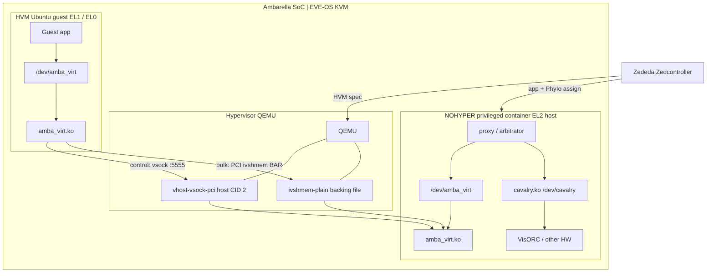
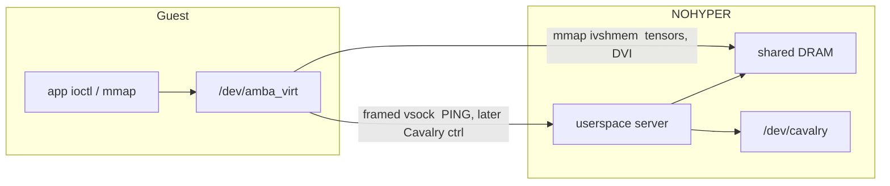
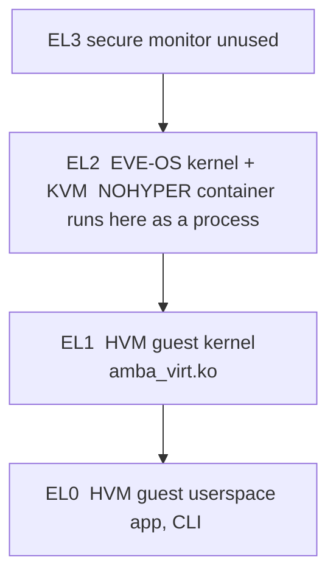

# System architecture (EVE-OS / N1-655)

Ambarella SoC boots **EVE-OS** (KVM). **Zededa Zedcontroller** orchestrates two
app types and device assignment. Hardware stays on the hypervisor side.
KVM guests talk to a privileged container over **virtio-vsock** (control) and
**ivshmem** (bulk).

Related: [VirtualDrivers.md](VirtualDrivers.md) (transport),
[CavalryVirtualization.md](CavalryVirtualization.md) (Cavalry proxy),
[EVE-Ambarella-Models.md](EVE-Ambarella-Models.md) (cloud PhyIo models),
[ZedControl-scripts.md](ZedControl-scripts.md) (zcli wrappers),
[poc/](../poc/README.md) (transport PoC).

## Diagram

Zedcontroller places two apps on the SoC: an Ubuntu **HVM** (KVM guest) and a
privileged **NOHYPER** container on the EVE host. Guests never own VisORC.
Control goes over virtio-vsock (CID 2, port 5555). Bulk data stays in ivshmem.

Do **not** copy bulk buffers on vsock. Do **not** use vsock port 2000 (EVE
VComLink). The container must not connect to a guest CID.

---

## Privilege model

| Role | What it is | ARM exception level |
|---|---|---|
| EVE-OS / KVM | Hypervisor OS on the SoC | EL2 (host kernel) |
| **NOHYPER** | Privileged Ubuntu **container** on that host kernel, not a VM | EL2-side process |
| **HVM** | KVM guest (Ubuntu). Guest kernel / userspace | EL1 / EL0 |
| Secure monitor | Not used by this stack | EL3 |

Do not call the Ubuntu VM EL3. The NOHYPER container does not “run at EL2” as a
hypervisor; it runs **on the hypervisor OS**. `insmod` inside a privileged
NOHYPER app loads a module into the **EVE host kernel**. Build that module
against `eve-kernel` (or the running EVE `/lib/modules/$(uname -r)/build`).
Build HVM modules against Ubuntu `linux-headers`. Do not give the guest the
Ambarella kernel tree.

Zedcontroller assigns devices (PhyIo / assigngrp) to the NOHYPER app so it can
open `/dev/cavalry` and similar nodes. HVMs must not own VisORC. Cloud model
inventory: [EVE-Ambarella-Models.md](EVE-Ambarella-Models.md).

---

## Transport

| Channel | Mechanism | Use |
|---|---|---|
| Control | virtio-vsock, framed SOCK_STREAM | ioctl-sized messages, PING/ECHO, later Cavalry ctrl |
| Bulk | ivshmem (shared DRAM) | tensors, DVI, CMA-sized buffers |

**virtio-vsock** is stock on EVE HVMs (`vhost-vsock-pci` / `eve-vsock0`).
Direction is **guest → host CID 2**. Do **not** use port **2000** (EVE
VComLink). The transport uses port **5555**. EVE does not publish guest CID↔UUID;
the container must not connect to a guest CID.

**ivshmem** is not on stock EVE HVMs. It needs a QEMU `memory-backend-file`
(share=on), `-device ivshmem-plain`, and that backing file bind-mounted into
the NOHYPER container. Device-model / Zedcontroller work is required on the
node; local QEMU can prove the path first.

Do not copy bulk data over vsock.

Both ends of the transport compile a matching kernel module (`amba_virt.ko`) that
exposes `/dev/amba_virt` (mmap of the shared region + framed vsock send/recv).
A userspace **server** in NOHYPER opens that chardev and later opens real
hardware. See [poc/](../poc/README.md).

vhost-user is an optional later transport, not the plan.

---

## Arbitration

One hardware owner: the NOHYPER process. Multiple EL1 guests may connect.

The server must:

- Serialize exclusive operations (`START_VP`, VisORC reset, firmware load).
- Quota ALLOC from the shared Cavalry pool so one guest cannot exhaust CMA.
- Admit `RUN_DAGS` with a queue (fair or priority). Host `cavalry.ko` already
  sequences jobs by `seq_num`; the proxy still decides **who may submit**.
- Recycle guest state on disconnect (memory, sessions).

---

## Out of scope

- MMIO / VFIO passthrough of VisORC into the guest (exclusive HW, GPA≠HPA,
  breaks multi-guest and EVE isolation).
- Custom VirtIO device ID as the primary control path.
- Connecting the container to a guest vsock CID.
