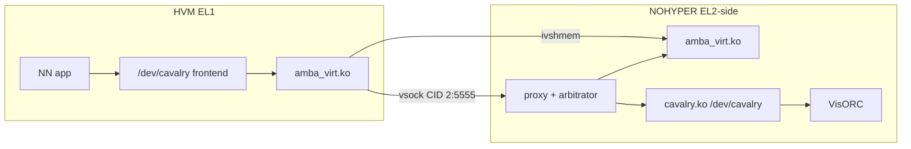

# Cavalry virtualization (N1-655 / EVE-OS)

Cavalry is Ambarella’s Vision Processor (VP / VisORC) Linux driver. Userspace
talks ioctl + mmap on `/dev/cavalry`. The kernel loads `cavalry.bin`, programs
VisORC MMIO, and submits jobs as **host-physical command descriptors**. The VP
DMA-reads those addresses.

On this platform the real driver stays in the **NOHYPER** container on EVE-OS.
KVM **HVM** guests (EL1) never load Ambarella `cavalry.ko`. They use the
vsock + ivshmem transport ([drivers/amba_virt/](../drivers/amba_virt/README.md)) and a later
frontend that preserves the v3 ioctl ABI.

System picture: [Architecture.md](Architecture.md). Transport details:
[PoCVirtualDrivers.md](PoCVirtualDrivers.md). Deploy:
[EVE-EdgeApp-Provision.md](EVE-EdgeApp-Provision.md).

Guest ABI to preserve:
`eve-kernel/ambarella/include/cavalry_v3/cavalry_ioctl.h`
(copy that UAPI into this repo for the HVM; do not mount `eve-kernel` into
the guest).

Host driver: **cavalry_v3** (`compatible = "ambarella,sub-scheduler"`).

---

## Architecture (proxy, not passthrough)



| | This architecture | Guest MMIO passthrough (rejected) |
|---|---|---|
| Who runs `cavalry.ko` | NOHYPER only | Guest |
| Guest `/dev/cavalry` | Frontend on `amba_virt` | Unmodified Ambarella module |
| Tensors | ivshmem; host rewrites tokens → HPA | Guest GPA must equal HPA |
| Multi-guest | Proxy arbitrates | Exclusive VisORC |
| EVE isolation | Preserved | Breaks device assign / shared SoC |

### Why not passthrough

Guest `cavalry.ko` `ioremap`s absolute SoC addresses, `mmap`s host PFNs, and
puts those phys addrs in DAG descriptors. Unless every carve-out is
identity-mapped into the guest **and** the host never uses Cavalry, the VP
DMA-reads the wrong DRAM. Reset/clocks are SoC-global. Multiple HVMs cannot
share VisORC. That conflicts with Zedcontroller + NOHYPER.

---

## 1. What the host driver is

The module matches DT `compatible = "ambarella,sub-scheduler"` and creates
`/dev/cavalry` (plus `/dev/cavalry_profile`) **inside NOHYPER** (after the
device is assigned).

| Layer | Role |
|---|---|
| Userspace (`cavalry_ioctl.h`) | ioctl + `mmap` of physically contiguous CV buffers |
| `cavalry.ko` | CMA/AMA allocator, firmware load, cmd/msg queues, doorbells, IRQs |
| `cavalry.bin` (VisORC ucode) | Scheduler + VP/FEX/FMA workers |
| Hardware | VisORC MMIO, RCT reset/clocks, scratchpad kicks, 4 IRQs |

**cavalry_v2** is CV2/CV22/CV25/CV28/CV5/CV52. **cavalry_v3** is N1, CV72/CV75,
CV7, CV8. This document is v3 / N1-655.

---

## 2. Host hardware map (N1-655)

Used by **NOHYPER** `cavalry.ko`, not the guest. From `n1_655.dts` and
`cavalry_v3/cavalry_visorc.c`.

### MMIO (hardcoded `ioremap`, not from DT)

| Name | HPA | Size | Use |
|---|---|---|---|
| VisORC APB | `0xffed000000` | 16 MB | Per-engine reset, L2 remap, status, audio ticks |
| RCT | `0xffed080000` | 4 KB | Cluster/VORC soft reset, PLLs |
| Kick sched | `0xFFF0200004` | 16 B | ARM → ORC doorbell (`writel(1, ...)`) |
| Kick ARM ACK | `0xFF00006000` | 16 B | ORC ↔ ARM handshake + IRQ timestamps |

N1-655 engines: NVP0 (`0x440000`), FEX0 (`0x3e0000`), Manager (`0x100000`).
L2 remap windows at `0x420000`, `0x3c0000`, `0x110000`.

v2 (for reference) uses VisORC at `0xed000000` (CV2x) or `0x20ed000000`
(CV5/CV52), 16 MB, and sync-counter doorbells at `+0x05F000`.

### IRQs (DT `sub_scheduler0`)

```dts
sub_scheduler0 {
    compatible = "ambarella,sub-scheduler";
    interrupts = <0 50 0x4>, <0 51 0x4>, <0 52 0x4>, <0 53 0x4>,
               <0 50 0x4>, <0 51 0x4>, <0 52 0x4>, <0 53 0x4>;
    memory-region = <&cavalry_reserved &cavalry_ucode>;
    shared-region = <&cavalry_shared>;
};
```

| Index | Host SPI | Name | Meaning |
|---|---|---|---|
| 0 | 50 | job submit | ORC accepted cmd-queue write |
| 1 | 51 | job done | Worker finished; MSG queue has `seq_num` |
| 2 | 52 | resv0 | ISR returns `IRQ_NONE` |
| 3 | 53 | resv1 | ISR returns `IRQ_NONE` |

### Reserved DRAM

| Node | HPA | Size | Attr |
|---|---|---|---|
| `cavalry_ucode` | `0x25c00000` | 4 MB | `no-map` — firmware + private queues |
| `cavalry_reserved` | `0x1_00000000` | 12 GB | `no-map` — user tensors / DVI |
| `cavalry_shared` | (unset in this DTS) | — | optional share-to-DSP |

`no-map` → `ioremap_wc` + AMA. `phys_to_orc_addr(phys) = phys`. Every DAG
port the VP uses is a **real SoC physical address**. Guest tokens must be
rewritten to these HPAs in NOHYPER before `ioctl(CAVALRY_RUN_DAGS)`.

### Private 4 MB (ucode region)

```
+0x000000  UCODE     1 MB    cavalry.bin; version @ +0x40; init_data @ +0x80
+0x100000  HOTLINK   1 MB    4 × 256 KB slots
+0x200000  CMD q     32 KB   ARM writes u64 cmd_phys per slot
+0x208000  MSG q     32 KB   ORC writes matching seq_num (u32)
           LOG, FEX/FMA cmd, IDSP, STATS, PROFILE
```

---

## 3. Userspace ABI (ioctl class `'C'`)

The ABI a guest frontend must preserve or proxy:

| Group | ioctls | Notes |
|---|---|---|
| Lifecycle | `START_VP` / `STOP_VP` | Load remap, reset ORC, wait for sched IRQ |
| Compute | `RUN_DAGS`, `RUN_DAGS_MEMFD` | Main NN path |
| Memory | `ALLOC/FREE/SYNC/QUERY_*`, `ALLOC_MEMFD` | CMA/AMA + dmabuf |
| Stereo | `FEX_*`, `FMA_*` | v3: same sched path |
| Hotlink | slot load/run | Extra firmware in private RAM |
| Session / crypto | session, ULP, NMP, convert-after-encrypt | Needs VP alive |
| Misc | clocks, chip id, status, log, profile | RCT / sysfs |

`read()` on `/dev/cavalry` is the ucode log ring.

---

## 4. Job protocol

One DAG run (`cavalry_run_dags` → `sched_send_task_cmd`):

```
ioctl(CAVALRY_RUN_DAGS)
  → copy dag_desc[], phys_to_orc_addr() every DRAM ptr
  → CMD[seq % N] = cmd_phys          // v3: u64
  → cache-clean cmd+msg
  → visorc_kick_sched()
  → wait job-submit IRQ (is_cmd_received)
  → wait job-done IRQ  (MSG[seq] == cmd_seq)
  → copy rval / ticks / finish_dags to userspace
```

Cmd codes (`cavalry_ucode_api.h`): `DAG_RUN=1`, `STOP=2`, `HOTLINK=3`, plus
FEX/FMA/session/crypto. Reply `msg_code = cmd | 0x80000000`.

Firmware boot (`visorc_start`): fill init_data, RCT reset, L2 remap → ucode
HPA, release reset, wait first sched IRQ. Host can
`ucode_auto_start=1` so guests never call `START_VP`.

---

## 5. v2 vs v3

| | v2 | v3 (N1-655) |
|---|---|---|
| Chips | CV2x, CV5, CV52 | N1, CV72/75, CV7, CV8 |
| Kick | Sync counters in VisORC | Scratchpad `0xFFF0200004` |
| IRQs | VP + FEX + FMA + sched | job-submit + job-done |
| Cmd queue entry | `u32` phys | `u64` phys |
| Extra cmd fields | — | `hw_type`, `affinity` |
| FEX/FMA | Separate queues + kicks | Same sched path |
| Ucode region | First 4 MB of one pool | Separate `cavalry_ucode` phandle |

---

## 6. Proxy over amba_virt

Control rides framed vsock (same `amba_virt` chardev as the PoC). Bulk rides
a **slice of the shared ivshmem window**, not a private BAR. The same 1 GiB
window also holds DMA and SD/eMMC bounce buffers; the host proxy allocator
gives Cavalry the majority by quota. Host `cavalry_reserved` (12 GB AMA)
stays on the SoC; the VP never DMA-reads the ivshmem BAR. Do not invent a
custom VirtIO device ID for milestone 1. Deploy:
[EVE-EdgeApp-Provision.md](EVE-EdgeApp-Provision.md).

### Ctrl frames

Little-endian. One request, one response, same `xid`.

```c
#define VCAV_PROTO_VER  1

enum vcav_op {
    VCAV_OP_IOCTL   = 1,
    VCAV_OP_MMAP    = 2,
    VCAV_OP_MUNMAP  = 3,
    VCAV_OP_READLOG = 4,
};

struct vcav_req_hdr {
    uint32_t proto;
    uint32_t xid;
    uint32_t op;
    uint32_t ioctl_cmd; /* Linux _IOWR('C', n, ...) when op==IOCTL */
    uint32_t flags;
    uint32_t payload_len;
    uint32_t n_handles;
    uint32_t reserved;
};

struct vcav_rsp_hdr {
    uint32_t proto;
    uint32_t xid;
    int32_t  linux_ret;
    uint32_t payload_len;
    uint32_t flags;
    uint32_t reserved;
};
```

Payload is the native v3 ioctl struct, except every field the real driver
treats as **HPA** is a **token** on the wire.

### Token vs HPA

```console
token (u64, e.g. 0xC0DE0000_00000000 | seq)
  → host_hpa
  → host_len
  → shm_offset in ivshmem
  → cache_en, share_to_dsp, creator_tgid
```

Guest `cavalry_mem.offset` is the token. Guest `mmap` maps ivshmem at
`shm_offset`, not a host PFN.

`port_dram_addr = token + byte_off` if tokens are page-aligned. Host:
`hpa = lookup(token_page).hpa + (addr - token_page)`, then validate the range.

### RUN_DAGS rewrite

| Field | Rule |
|---|---|
| `ucode_cmd_phys` | 0 → host allocates cmd buffer; else token → HPA |
| `dag_desc[i].dvi_dram_addr` | token + offset → HPA |
| `extra_poke_list_daddr`, `extra_dag_desc_*_daddr` | same |
| `port_desc[j].port_dram_addr` | same |
| `port_daddr_increment` | leave |

Then `ioctl` real `/dev/cavalry` in NOHYPER. Copy `rval` / ticks /
`finish_dags` back.

`CAVALRY_SYNC_CACHE_MEM`: flush guest mapping **and** host CMA
(`ambcache_clean_range`). Missing host clean yields silent wrong results.

### ioctl coverage

**Milestone 1** (after `amba_virt` PING/shm works):
`GET_DRIVER_VERSION`, `GET_CV_CHIP_ID`, `GET_CAVALRY_STATUS`, clocks,
`ALLOC/FREE/SYNC_CACHE_MEM`, usage queries, `QUERY_BUF`, `RUN_DAGS`.
`START_VP` / `STOP_VP`: no-op or host-owned.

**Milestone 2:** memfd variants, FEX/FMA, `DMA_COPY`, log/profile.

**Milestone 3:** session, ULP, NMP, hotlink, core-dump, monitor sysfs.

### Guest frontend

Later: a small kmod (or userspace) presenting `/dev/cavalry` with the v3
`file_operations`, implemented on `/dev/amba_virt`. `release` must tell
NOHYPER to recycle that tgid. Do not ship Ambarella `cavalry.ko` in the HVM.

---

## 7. Arbitration

The NOHYPER server is the only process that opens real `/dev/cavalry`.

- **`START_VP`:** once, at server start (`ucode_auto_start` or explicit).
  Guests do not reset VisORC.
- **ALLOC:** per-guest quota on the user partition; reject when exhausted.
- **`RUN_DAGS`:** admission queue (priority from the ioctl `priority` field).
  Host cavalry already sequences by `seq_num`.
- **Disconnect:** `cavalry_cma_recycle` / session recycle for that guest.
- **Hang:** surface `MSG_RVAL_VP_HANG` to the submitter; do not let a second
  guest `START_VP` while hung unless the server owns recovery.

---

## 8. Implementation order

1. [drivers/amba_virt/](../drivers/amba_virt/README.md): vsock PING + ivshmem pattern
   on local QEMU, then on EVE (vsock stock; ivshmem needs QEMU/device-model).
2. NOHYPER: confirm real `/dev/cavalry` + ucode started.
3. Ctrl-only proxy: `GET_DRIVER_VERSION` / `GET_CV_CHIP_ID` over the transport.
4. `ALLOC_MEM` + mmap ivshmem + host hexdump of HPA + cache sync.
5. `RUN_DAGS` with token rewrite; compare `rval` / ticks to native.
6. Recycle on guest close; then quotas / multi-guest.

---

## 9. Source map

| Path | Role |
|---|---|
| `eve-kernel/ambarella/cavalry/cavalry_v3/cavalry_dev.c` | ioctl table, mmap, IRQs |
| `.../cavalry_visorc.c` | MMIO, boot, kicks |
| `.../cavalry_vp.c` | `RUN_DAGS` |
| `.../cavalry_utils.c` | cmd queue |
| `.../cavalry_cma.c`, `cavalry_ama.c` | phys pool |
| `eve-kernel/ambarella/include/cavalry_v3/cavalry_ioctl.h` | guest ABI (copy UAPI only; guest `KDIR` is Ubuntu) |
| `eve-kernel/arch/arm64/boot/dts/ambarella/n1_655.dts` | addresses |
| `amba-virt/drivers/amba_virt/` | vsock + ivshmem transport |
