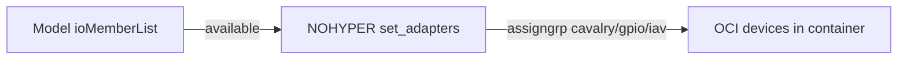

# EVE Ambarella hardware models

ZEDEDA Cloud inventory for Ambarella N1-655. **Cloud `ioMemberList` is
authoritative.** This is not an app-instance or QEMU recipe.

Related: [Architecture.md](Architecture.md) (PhyIo / NOHYPER),
[VirtualDrivers.md](VirtualDrivers.md) (vsock + ivshmem),
[ZedControl-scripts.md](ZedControl-scripts.md) (zcli wrappers),
[poc/](../poc/README.md) (transport PoC).

Brand **Ambarella** is `ORIGIN_LOCAL`. Two models exist. Do not invent a third.

| Cloud name | Title | UUID | State | rev |
|---|---|---|---|---|
| `N1-655-Cooper-Pro` | Ambarella N1-655 Cooper Pro | `0edf44c9-af69-428c-a835-ac001715e6d3` | Active | 4 |
| `N1-655-Cooper-Devkit` | Ambarella N1-655 Cooper Devkit | `dc7d22b4-855b-4267-be8f-0e5ced74b728` | Active | 3 |

Both are ARM64, 4 CPUs, 32G memory, 32G storage, watchdog on, HSM/LEDs off.
DTS `model` is `n1-655 cooper pro`. Source JSON:
[models/N1-655-Cooper-Pro.json](../models/N1-655-Cooper-Pro.json),
[models/N1-655-Cooper-Devkit.json](../models/N1-655-Cooper-Devkit.json).
Refresh those files from the controller with
[`scripts/get_models.sh`](../scripts/get_models.sh)
(`ZCLI_TOKEN` already in the environment; `--dry-run` prints without writing).
All ZedControl wrappers: [ZedControl-scripts.md](ZedControl-scripts.md).

## ztype map

| Cloud `ztype` | EVE `PhyIoType` | Number |
|---|---|---|
| `IO_TYPE_ETH` | `PhyIoNetEth` | 1 |
| `IO_TYPE_USB` | `PhyIoUSB` | 2 |
| `IO_TYPE_COM` | `PhyIoCOM` | 3 |
| `IO_TYPE_HDMI` | `PhyIoHDMI` | 7 |
| `IO_TYPE_USB_CONTROLLER` | `PhyIoUSBController` | 13 |
| `IO_TYPE_CAN` | `PhyIoCAN` | 15 |
| `IO_TYPE_OTHER` | `PhyIoOther` | 255 |

`PhyIoOther` uses `phyaddrs.Ifname` as a host chardev. EVE injects that path
into the NOHYPER OCI spec when the app is assigned the `assigngrp`.

## Assignment rules

- Empty `assigngrp`: EVE keeps the adapter; apps cannot take it.
- Same non-empty `assigngrp`: one unit, assignable to one app instance.
- `usage` `ADAPTER_USAGE_MANAGEMENT`: EVE management port. Do not assign it
  to an app even if `assigngrp` is set.
- Assign `cavalry`, `gpio`, and `iav` only to the NOHYPER app. HVMs must
  not get VisORC / Cavalry.

## Shared `ioMemberList`

Both models have the same adapters (`zcli model show … --detail`):

| phylabel | logicallabel | ztype | assigngrp | phyaddrs | usage |
|---|---|---|---|---|---|
| USB | USB | `IO_TYPE_USB_CONTROLLER` | USB | — | unspecified |
| COM1 | COM1 | `IO_TYPE_COM` | COM1 | `Serial=/dev/ttyS0` | unspecified |
| eth0 | eth0 | `IO_TYPE_ETH` | eth0 | `Ifname=eth0` | **management** |
| cavalry | cavalry | `IO_TYPE_OTHER` | cavalry | `Ifname=/dev/cavalry` | unspecified |
| cavalry_profile | cavalry_profile | `IO_TYPE_OTHER` | cavalry | `Ifname=/dev/cavalry_profile` | unspecified |
| gpio0 | gpio0 | `IO_TYPE_OTHER` | gpio | `Ifname=/dev/gpiochip0` | unspecified |
| iav | iav | `IO_TYPE_OTHER` | iav | `Ifname=/dev/iav` | unspecified |

`/dev/ucode` was not added (not confirmed on the host). Assigning a missing
`Ifname` makes EVE skip that device in the OCI spec (`getDeviceInfo` fails).

Confirm on the edge node before assigning to NOHYPER:

```bash
ls -l /dev/cavalry /dev/cavalry_profile /dev/gpiochip0 /dev/iav
```

## Assign adapters to edge apps

The model only **publishes** adapters. No app gets `/dev/cavalry` until the
**edge-app instance** lists that `assigngrp`. Attach `cavalry`, `gpio`, and
`iav` to the NOHYPER container only. Keep them off the HVM.

Wrappers: [ZedControl-scripts.md](ZedControl-scripts.md). `$ZCLI_TOKEN` must
already be in the environment.



### 1. Find both instances

```bash
./scripts/show_instances.sh
./scripts/show_instances.sh ubuntu_24_04_container.n1-655-pro
./scripts/show_instances.sh ubuntu_24_04.n1-655-pro
```

| Role | Typical name | Adapters |
|---|---|---|
| NOHYPER container | `ubuntu_24_04_container.n1-655-pro` | cavalry, gpio, iav |
| HVM | `ubuntu_24_04.n1-655-pro` | **none** of those |

Cloud instance names may differ. `zcli update --adapter=` **replaces** all
interfaces (including networks). `set_adapters.sh` keeps current networks.

### 2. Edge-app interfaces (if missing)

The left side of `--adapter=intfname:assigngrp` must exist on the
**edge-app** manifest. Group `cavalry` covers both `/dev/cavalry` and
`/dev/cavalry_profile`.

```bash
./scripts/show_app.sh ubuntu_24_04_container
```

If those interfaces are missing, add them on the bundle (`edge-app update
--manifest` + version bump), then
`./scripts/restart_instance.sh <INSTANCE> --refresh`. That bundle edit is
not wrapped yet. Do not add Cavalry / GPIO / IAV interfaces to the HVM
edge-app.

### 3. Attach on the NOHYPER instance

```bash
./scripts/set_adapters.sh ubuntu_24_04_container.n1-655-pro \
  --adapter=cavalry:cavalry --adapter=gpio0:gpio --adapter=iav:iav \
  --allow-visorc --dry-run
./scripts/set_adapters.sh ubuntu_24_04_container.n1-655-pro \
  --adapter=cavalry:cavalry --adapter=gpio0:gpio --adapter=iav:iav \
  --allow-visorc --restart
```

Use the real `intfname` from `show_app.sh` on the left. `--restart`
recreates OCI devices. GUI: instance → I/O Adapters → add those groups →
save → restart.

### 4. Confirm the HVM is clean

```bash
./scripts/show_instances.sh ubuntu_24_04.n1-655-pro
```

If cavalry / gpio / iav appear:

```bash
./scripts/set_adapters.sh ubuntu_24_04.n1-655-pro --clear-adapters --restart
```

HVMs must not own VisORC.

### 5. Verify on the node

Inside the **container** (not the VM):

```bash
ls -l /dev/cavalry /dev/cavalry_profile /dev/gpiochip0 /dev/iav
```

On the **HVM** those host Cavalry nodes must not be passed through.

## DTS mapping

| Cloud adapter | N1-655 DT | Notes |
|---|---|---|
| eth0 | `mac0` (`ethernet0`) | Management; leave with EVE. |
| USB | `usb_cdnsp` | Assignable as group `USB`. |
| COM1 `/dev/ttyS0` | `uart0` (`serial0`, stdout) | Console. Do not assign away from EVE. |
| cavalry, cavalry_profile | `sub_scheduler0` | NOHYPER only. |
| gpio0 | `gpio@0` (123 lines) | NOHYPER only. |
| iav | `compatible = "ambarella,iav"` | VIN/DSP through this chardev. |

## Not in cloud model

| Expected | Why it matters | Suggested ztype if added later |
|---|---|---|
| `mac1` / eth1 | Second RGMII (not enabled in `n1_655.dts`) | `IO_TYPE_ETH` |
| uart1–uart4 | Extra COM in dtsi | `IO_TYPE_COM` |
| `can0`–`can2` | dtsi CAN | `IO_TYPE_CAN` |
| `/dev/ucode` | IAV companion if present on host | `IO_TYPE_OTHER` (`assigngrp` `iav`) |
| PowerVR GPU | `ambarella,pvr-gpu` | `IO_TYPE_HDMI` + CDI, if used |

## Out of model (not `ioMemberList`)

- **virtio-vsock** is stock on every HVM (`vhost-vsock-pci`). Not an adapter.
- **ivshmem** is a QEMU `memory-backend-file` + `ivshmem-plain`, bind-mounted
  into NOHYPER. Not an `ioMemberList` entry.

See [poc/README.md](../poc/README.md) and [VirtualDrivers.md](VirtualDrivers.md).
