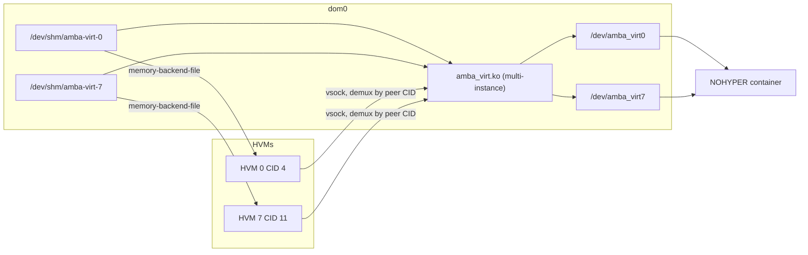

# Multiple HVMs on one ivshmem host (deferred)

Scaling the `amba_virt` transport past **one** HVM/NOHYPER pair. Nothing here is
implemented; the current design and the in-flight EVE patch are deliberately
scoped to a single pair. This records what breaks at N > 1 so the topic can be
picked up later without re-deriving it.

Related: [Architecture.md](Architecture.md) (the N=1 split),
[VirtualDrivers.md](VirtualDrivers.md) (transport),
[Native-ivshmem-Support-in-EVE-BaseOS.md](Native-ivshmem-Support-in-EVE-BaseOS.md)
(the EVE-side patch), [poc/README.md](../poc/README.md) (the modules discussed
below).

Several virtual drivers **inside one guest** (Cavalry, DMA, SD/eMMC) share
the single N=1 window. That is not this document. Production that window is
**1 GiB**. [EVE-EdgeApp-Provision.md](EVE-EdgeApp-Provision.md).

## The question

Eight HVMs, each with a private 256 MB ivshmem window shared with NOHYPER.
Total 2 GB of shared memory on an N1-655 devkit.

**Verdict: memory is not the problem. The kernel module is.** The PoC `amba_virt`
module is structurally single-instance, so N > 1 does not work today at any
window size.

## Memory: 2 GB fits

`estimatedVMMOverhead` in `eve/pkg/pillar/hypervisor/kvm.go` charges a
1 GiB / 2-vCPU HVM as follows:

| Term | Function | Value |
|---|---|---|
| Fixed QEMU allocation | `undefinedVMMOverhead()` | 350 MiB |
| Guest page tables (2.5% of RAM) | `ramVMMOverhead()` | 25.6 MiB |
| QEMU binaries and libraries | `qemuVMMOverhead()` | 20 MiB |
| vCPUs (3 MiB each) | `cpuVMMOverhead()` | 6 MiB |
| Passthrough MMIO aperture | `mmioVMMOverhead()` | 0 |
| **Overhead total** | | **401.6 MiB** |
| **Booked per app** (1024 + overhead) | | **1425.6 MiB** |

That 1425.6 MiB matches the QEMU container's measured cgroup limit on the node
(1,494,847,488 bytes) exactly, which confirms the model.

Eight of those is 11,405 MiB. Adding 8 × 256 MiB of windows brings it to
13,453 MiB against roughly 17.9 GB of dom0 RAM, leaving a few GB before EVE's
own reservation (`memory.eve.limit.MiB`, derived at runtime from the EVE
cgroup). `/dev/shm` is 8.9 GB, so the eight backing files fit there as well.

No PCI constraint either: `ivshmem-plain` registers a 64-bit prefetchable BAR2
that lands in the arm `virt` machine's high MMIO window (512 GiB), and each
guest has its own PCI bus. 256 MB is already a power of two, which the BAR
requires.

## What EVE does not currently account for

Three gaps, all of which matter more at 256 MB than at the PoC's 16 MB, and all
of which apply at N=1 too:

1. **`estimatedVMMOverhead` has no ivshmem term.** The window is real RAM that
   the estimator does not see. At 16 MB it hides inside the 350 MiB fixed slack;
   at 256 MB it does not, and the QEMU container is OOM-killed as the guest
   faults the window in. This is the reason the N=1 patch must add
   `cbattr.shmsize` to the overhead, not just emit the device.
2. **`getRemainingMemory` is blind to it.** In
   `eve/pkg/pillar/cmd/zedmanager/memorysizemgmt.go` admission control sums only
   `FixedResources.Memory + MemOverhead` per app. Fixing (1) fixes this too,
   since `MemOverhead` comes from `CountMemOverhead` -> `vmmOverhead`. At eight
   apps the difference between accounted and actual would be 2 GB, which is
   enough to let EVE admit an app that cannot fit.
3. **tmpfs pages are charged to the first cgroup that faults them in**, and stay
   charged for the life of the *file*, not the VM. If the NOHYPER side touches a
   window before QEMU does, the container's cgroup absorbs 256 MiB it was not
   sized for. Both sides need the size in their limits, or the file needs
   deliberate pre-faulting in one known cgroup.

## The blocker: the PoC module is single-instance

Host side, `poc/kmod/nohyper/amba_virt_nohyper.c`:

```c
static char *shm_path = "/dev/shm/amba-virt";
module_param(shm_path, charp, 0644);

static struct amba_virt_dev gdev;
```

One global device struct, one backing-file path. And in
`poc/kmod/common/amba_virt_core.c`, exactly one character device minor:

```c
ret = alloc_chrdev_region(&dev->devt, 0, 1, AMBA_VIRT_DEV_NAME);
```

The module is loaded once in dom0 and is host-wide, so "one module instance per
container" is not available: there is a single `/dev/amba_virt` bound to a
single region. Eight NOHYPER containers cannot each get their own.

The vsock half is closer to workable. `accept_one()` does loop on
`kernel_accept`, so a single listener could take connections from multiple guest
CIDs, but it has nowhere to route them because there is only one region.

## What N > 1 would require



Kernel module work:

- N minors instead of one: `alloc_chrdev_region(..., N, ...)` with a per-instance
  `struct amba_virt_dev` array replacing the global `gdev`.
- Per-instance backing file. A `charp` array module param is the cheap version;
  a sysfs or configfs attach/detach interface is the version that survives adding
  an HVM without reloading the module and dropping every existing mapping.
- vsock demultiplexing by peer CID in the accept path, mapping a connecting guest
  to its instance. Needs a CID-to-instance binding, which EVE assigns
  (`clientCid` increments per domain, so eight domains take CIDs 4 through 11).

EVE side (an extension of the N=1 patch, not a redesign):

- Eight `amba_shm_N` bundles, each with its own `assigngrp` and its own
  `cbattr.shmpath`. Group exclusivity already prevents two apps sharing a window,
  which is what keeps them from corrupting each other.
- Eight `amba_virt_N` bundles for the container side. One app instance can hold
  many assignment groups, so a single NOHYPER container can take all eight.

## Decision

Deferred. The N=1 patch is a strict subset of this work and none of it is
throwaway: per-instance `shmpath` in `cbattr`, separate assignment groups, and
ivshmem-aware overhead accounting are all required at N=1 and all generalise.
The multi-instance module rewrite is the only genuinely new piece.
