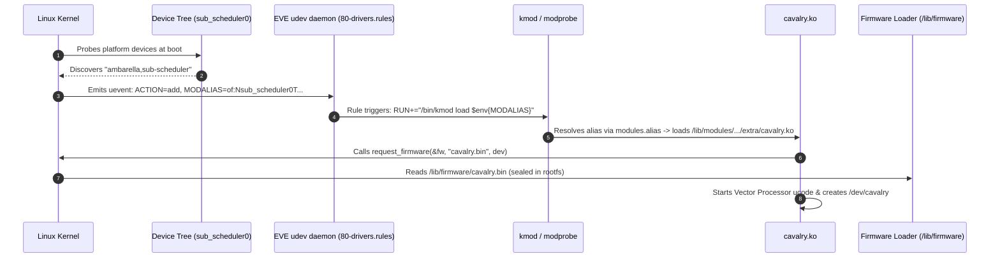
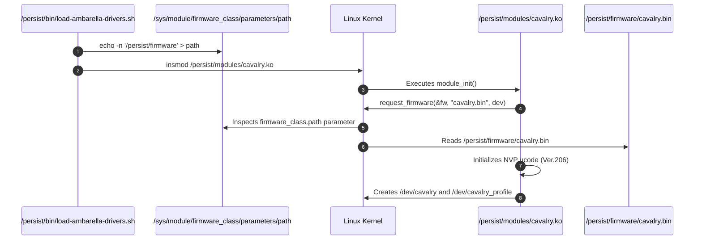

# EVE-OS Out-of-Tree Kernel Modules (KMODs): Architecture & Dual Modes

- **Date**: 2026-09-11
- **Platform**: Ambarella N1-655 (`cv3ad655`) / EVE-OS (kernel 6.1.112)
- **Target Boards**: `n1-655-devkit`, `n1-655-pro`
- **Related Documents**: [TODO.md](../automation/doc/TODO.md) §5.3, §5.4, [Issues.md](../automation/doc/Issues.md), [Design.md](../automation/doc/Design.md), [EveBootTimeOptimization.md](../automation/doc/EveBootTimeOptimization.md)

---

## 1. Overview & Problem Statement

Ambarella edge platforms rely on proprietary hardware accelerators and virtualization transport layers that require specialized kernel drivers and microcode:

1. **`cavalry.ko`**: The Ambarella Vector Processor (NVP/VP) accelerator driver managing reserved CMA carveouts (`0x100000000 - 0x3ffffffff`, 12 GB), microcode staging (`0x25c00000 - 0x25ffffff`, 4 MB), command/message queues, doorbells, and IRQs (41/42).
2. **`cavalry.bin`**: Hardware microcode executed directly by the on-chip Vector Processor scheduler.
3. **`amba_virt.ko`**: POSIX shared memory / IVSHMEM transport driver providing zero-copy IPC between KVM HVM virtual machines and containerized workloads.

EVE-OS enforces strict security constraints:
- **Module Signature Enforcement**: `CONFIG_MODULE_SIG_FORCE=y` requires every `.ko` module to carry a valid cryptographic signature matching a root/trusted X.509 certificate compiled into the kernel.
- **Read-Only Root Filesystem**: The operating system root is a read-only SquashFS container (`rootfs.img`). `/lib/modules` and `/lib/firmware` cannot be modified at runtime.

To reconcile these security guarantees with the need for fast developer turnaround, EVE-OS provides **two distinct operational modes**:

```mermaid
flowchart TD
    subgraph DevMode["Development Mode (Host Out-of-Tree)"]
        D_SRC["Driver Source Code (cavalry, amba_virt)"]
        D_KEY["Persistent Local Key (eve-kernel/certs/signing_key.pem)"]
        D_BLD["Host Build Script (build_kmod_out_of_tree.sh)"]
        D_SIGN["Host sign-file (sha256)"]
        D_STAGE["Writable Flash (/persist/modules, /persist/firmware)"]
        D_INS["Dynamic Redirection & insmod (load-ambarella-drivers.sh)"]

        D_SRC --> D_BLD
        D_KEY --> D_SIGN
        D_BLD --> D_SIGN
        D_SIGN --> D_STAGE
        D_STAGE --> D_INS
    end

    subgraph ProdMode["Production Mode (Hermetic Single-Image)"]
        P_SRC["Driver Source Code (cavalry, amba_virt)"]
        P_CTX["Docker BuildKit External Contexts (--build-context)"]
        P_EPH["Ephemeral Single-Use Key (kbuild)"]
        P_MOD["Kernel extra/ Directory (/lib/modules/.../extra/)"]
        P_FW["Kernel Firmware Directory (/lib/firmware/cavalry.bin)"]
        P_DEP["depmod (modules.alias from DTS compatible)"]
        P_UDEV["udev Early Userspace (kmod load $MODALIAS)"]

        P_SRC --> P_CTX
        P_CTX --> P_EPH
        P_EPH --> P_MOD
        P_EPH --> P_FW
        P_MOD --> P_DEP
        P_DEP --> P_UDEV
    end
```



---

## 2. Boot-Time Insertion Mechanism: How `cavalry.ko` Gets Loaded

A core difference between Development and Production modes is how `cavalry.ko` is discovered and loaded during the boot sequence.

### 2.1 Production Mode: Fully Automatic Boot via `udev`

In Production Mode, module insertion is **100% automated by early userspace**:



1. **Device Tree Binding**: The kernel parses the `sub_scheduler0` node (`compatible = "ambarella,sub-scheduler"`).
2. **Uevent Generation**: The kernel emits a device-add uevent containing `MODALIAS`.
3. **Udev Match**: `/etc/udev/rules.d/80-drivers.rules` matches the modalias:
   ```udev
   ACTION=="add", ENV{MODALIAS}!="", RUN{builtin}+="kmod load $env{MODALIAS}"
   ```
4. **Modprobe Resolution**: `kmod load` consults `/lib/modules/$(uname -r)/modules.alias`, which maps the device compatible string directly to `cavalry.ko`.
5. **Firmware Resolution**: `request_firmware()` searches `/lib/firmware/cavalry.bin`, which is sealed into `rootfs.img`.
6. **No manual intervention or scripts required.**

---

### 2.2 Development Mode: Dynamic Staging & Redirection

In Development Mode, `cavalry.ko` resides on the writable persistent partition (`/persist/modules/`), **outside** the read-only rootfs:

- Because `cavalry.ko` is not in `/lib/modules/`, `depmod` has not indexed it.
- When `udev` attempts `kmod load $MODALIAS`, no in-tree driver is found.
- Therefore, **`cavalry.ko` is not automatically loaded by udev at boot time in Development Mode**.

To initialize the driver in Development Mode, the dynamic redirection sequence must be executed:



#### The Helper Script (`/persist/bin/load-ambarella-drivers.sh`)
```bash
#!/bin/sh
set -e

# 1. Redirect kernel firmware search path to non-volatile flash
if [ -f /persist/firmware/cavalry.bin ]; then
    echo -n '/persist/firmware' > /sys/module/firmware_class/parameters/path
fi

# 2. Insert cavalry module if devnode is missing
if [ -f /persist/modules/cavalry.ko ]; then
    if [ ! -e /dev/cavalry ]; then
        if lsmod | grep -q cavalry; then
            rmmod cavalry 2>/dev/null || true
        fi
        insmod /persist/modules/cavalry.ko
    fi
fi

# 3. Insert virtualization transport driver
if [ -f /persist/modules/amba_virt.ko ]; then
    if [ ! -e /dev/amba_virt ]; then
        if lsmod | grep -q amba_virt; then
            rmmod amba_virt 2>/dev/null || true
        fi
        insmod /persist/modules/amba_virt.ko
    fi
fi
```

> [!IMPORTANT]
> The order of operations is critical: `/sys/module/firmware_class/parameters/path` **must** be set to `/persist/firmware` **before** `insmod /persist/modules/cavalry.ko` is called. If `cavalry.ko` is inserted before the firmware path is configured, `request_firmware()` will search only `/lib/firmware`, fail with `-ENOENT` (-2), fall back to a 60-second sysfs timeout, and abort probing.

---

## 3. Detailed Mode Comparison

| Architectural Property | Development Mode | Production Mode |
|---|---|---|
| **Primary Purpose** | Rapid driver debugging & code iteration | Sealed, zero-trust appliance deployment |
| **Driver Storage** | `/persist/modules/*.ko` (ext4 flash) | `/lib/modules/<ver>/extra/*.ko` (SquashFS) |
| **Microcode Storage** | `/persist/firmware/cavalry.bin` | `/lib/firmware/cavalry.bin` |
| **Firmware Search** | Dynamic redirection via sysfs `path` | Standard kernel search in `/lib/firmware` |
| **Signing Key Type** | Persistent local key (`certs/signing_key.pem`) | Ephemeral key dynamically created in Docker |
| **Signing Key Lifetime**| Persisted on development host | Destroyed immediately when Docker build finishes |
| **Signing Execution** | Host script (`scripts/sign-file`) | `kbuild modules_install` inside Docker |
| **Boot-Time Trigger** | Helper script (`load-ambarella-drivers.sh`) | Automatic `udev` (`kmod load $MODALIAS`) |
| **Iteration Turnaround**| **~3 seconds** (recompile -> scp -> reload) | **~30 minutes** (full OS build -> OTA -> reboot) |
| **Reboot Required?** | **No** (can unload/reload live) | **Yes** (OTA rootfs update & cold boot) |
| **OTA Impact** | Modules survive across A/B partition flips | Modules updated atomically with `rootfs.img` |
| **TPM PCR 13 Impact** | Excluded from dm-verity / PCR 13 | Measured into TPM PCR 13 via SquashFS |

---

## 4. Development Mode Deep Dive

### 4.1 Prerequisites & Kernel Signature Alignment

Because `CONFIG_MODULE_SIG_FORCE=y` is enforced by the kernel:
1. The kernel build must incorporate the public certificate of the development key into its builtin system keyring (`system_trusted_keyring`).
2. The private key (`signing_key.pem`) is retained on the developer workstation under `eve-kernel/certs/` or `build/certs/` (ignored by `.gitignore`).
3. If the kernel is rebuilt, modules compiled on the host **must** match the exact kernel version magic string (e.g. `6.1.112-linuxkit-310c92224386-...`).

### 4.2 Building Out-of-Tree on the Host

The script `scripts/build_kmod_out_of_tree.sh` automates the compilation and signing:

```bash
# Build both cavalry.ko and amba_virt.ko against active kernel headers
./scripts/build_kmod_out_of_tree.sh
```

Under the hood, this script:
1. Locates the extracted kernel headers (`build/usr/src/linux-headers-...` extracted via `make eve-kernel-headers`).
2. Invokes kbuild out-of-tree:
   ```bash
   make -C "$KDIR" M="$SRC_DIR" modules ARCH=arm64 CROSS_COMPILE=aarch64-linux-gnu-
   ```
3. Uses `sign-file` to append a CMS cryptographic signature to the ELF binary:
   ```bash
   $KDIR/scripts/sign-file sha256 build/certs/signing_key.pem build/certs/signing_key.x509 cavalry.ko
   ```
4. Verifies the module signature footer with `modinfo`:
   ```text
   signer:         Build time autogenerated kernel key
   sig_key:        41:67:4C:36:67:77:67:7B:59:9C:49:8D:F8:D1:16:C4:13:6D:F8:DF
   sig_hashalgo:   sha256
   signature:      ...
   ```

### 4.3 Deploying and Reloading Live (No Reboot)

To push modified modules to a live board without rebooting:

```bash
./scripts/deploy_and_insmod.sh 192.168.8.33 --reload
```

This workflow executes in **under 3 seconds**:
1. Copies `cavalry.ko` and `amba_virt.ko` to `/persist/modules/`.
2. Copies `cavalry.bin` to `/persist/firmware/`.
3. Sets `/sys/module/firmware_class/parameters/path`.
4. Removes existing modules (`rmmod amba_virt cavalry`) and re-inserts the newly built binaries.
5. Verifies `/dev/cavalry`, `/dev/cavalry_profile`, and `/dev/amba_virt`.

---

## 5. Production Mode Deep Dive

### 5.1 Zero-Trust Ephemeral Signing

In Production Mode, the developer's workstation holds **no private keys**:

1. When `make set-mode-production && make eve` is invoked, Docker BuildKit mounts the driver sources into the container using external contexts:
   ```dockerfile
   # syntax=docker/dockerfile:1.6
   FROM scratch AS cavalry
   FROM scratch AS amba-virt
   ...
   ```
2. The kernel build generates a unique, single-use 4096-bit RSA key pair during compilation (`certs/signing_key.pem`).
3. `kbuild` compiles the out-of-tree drivers alongside in-tree modules.
4. During `make modules_install`, all modules are signed with the ephemeral key.
5. The public X.509 certificate is embedded into the kernel binary (`/boot/kernel`).
6. The container finishes, and the private key is **permanently destroyed**.
7. Result: The root filesystem image (`rootfs.img`) is sealed and hermetic. No attacker or third party can sign rogue kernel modules post-build.


---

## 6. How to Automate Development Mode Loading on Boot

If Development Mode modules must be inserted automatically upon board cold boot, EVE-OS can be configured with an onboot hook.

### 6.1 Recommended Approach: `storage-init` Hook

In EVE's startup architecture, `storage-init` is the onboot container responsible for checking, formatting, and mounting `/persist`.

Because `/persist` is mounted before core services launch:
1. Mount `/persist` on `/persist`.
2. Check for the existence of `/persist/bin/load-ambarella-drivers.sh`.
3. Execute the script inside `storage-init` or before `pillar` starts:
   ```bash
   if [ -x /persist/bin/load-ambarella-drivers.sh ]; then
       echo "Loading Ambarella development drivers..."
       /persist/bin/load-ambarella-drivers.sh
   fi
   ```
4. This ensures `/dev/cavalry` and `/dev/amba_virt` exist **before** `domainmgr` begins starting edge containers, avoiding container startup device assignment race conditions.

---

## 7. Troubleshooting & Common Pitfalls

### Pitfall 1: Firmware Load Timeout (-2 / -ENOENT)
- **Symptom**: `cavalry sub_scheduler0: Direct firmware load for cavalry.bin failed with error -2`, followed by a 60s freeze.
- **Root Cause**: `firmware_class.path` was not pointed to `/persist/firmware` prior to `insmod`.
- **Fix**: Run `echo -n '/persist/firmware' > /sys/module/firmware_class/parameters/path` before inserting `cavalry.ko`.

### Pitfall 2: Module Verification Failed (`Key was rejected by service`)
- **Symptom**: `insmod: can't insert 'cavalry.ko': Permission denied` (dmesg: `Loading of unsigned module is rejected`).
- **Root Cause**: The module was compiled without signing, or was signed with a key whose public certificate is not embedded in `/boot/kernel`.
- **Fix**: Re-sign with the active key matching the kernel using `scripts/sign-file sha256 certs/signing_key.pem certs/signing_key.x509 cavalry.ko`.

### Pitfall 3: Invalid Module Format (`version magic mismatch`)
- **Symptom**: `insmod: can't insert 'cavalry.ko': invalid module format` (dmesg: `version magic '...ac6b5c0e15b0...' should be '...310c92224386...'`).
- **Root Cause**: The running kernel on the target board was updated (e.g. via OTA or partition flip), but the modules in `/persist/modules/` were compiled against an older commit.
- **Fix**: Run `./scripts/build_kmod_out_of_tree.sh` against the updated kernel source tree, then redeploy with `deploy_and_insmod.sh`.

### Pitfall 4: Container Missing Assigned Adapter
- **Symptom**: Application container fails to access `/dev/cavalry` even though the module is loaded.
- **Root Cause**: The container was started by EVE **before** `cavalry.ko` was loaded, so `domainmgr` did not inject the device cgroups into the container OCI spec.
- **Fix**: Restart the edge app container after loading the driver:
  ```bash
  eve app restart <app-name>
  ```
