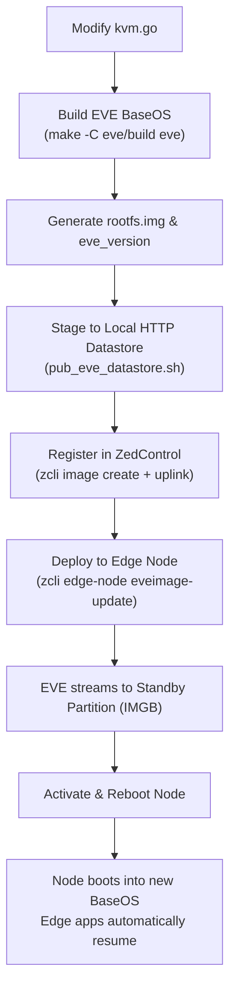

# Native ivshmem Support in EVE BaseOS

## 1. Executive Summary & Objective

The Ambarella virtualization architecture relies on two complementary transport mechanisms between the guest domain (Ubuntu HVM at EL1) and the host container (NOHYPER at EL2):

1. **`virtio-vsock` (Control Plane)**: Low-latency, connection-oriented point-to-point RPC and control messaging (CID 2, port 5555).
2. **`ivshmem` (Data Plane)**: Zero-copy 16MB shared DRAM window (`ivshmem-plain`, PCI vendor `0x1af4`, device `0x1110`, BAR 2) mapped to a shared backing file in host memory (`/dev/shm/amba-virt`).

While `virtio-vsock` is already enabled by stock EVE BaseOS, `ivshmem-plain` is currently absent from EVE's hypervisor device model. This document details the technical background, explains why runtime workarounds are unsuitable for production, and outlines the complete proposed implementation for integrating native `ivshmem` support directly into EVE BaseOS.

---

## 2. Background & Problem Analysis

### 2.1 Current Stock EVE Behavior

In stock EVE BaseOS (running KVM hypervisor on `arm64`):
- `domainmgr` automatically injects a `vhost-vsock-pci` device (`eve-vsock0`, guest CID 4) into every HVM domain configuration.
- Inside the guest, `lspci -nn` verifies the virtio socket device at `00:06.0 [1af4:1053]`.
- However, no `ivshmem` device is defined in EVE's QEMU templates. Consequently, the guest PCI bus has no device matching `1af4:1110`.
- Because the guest kernel module (`amba_virt.ko`) is implemented as a standard Linux PCI driver for `1af4:1110`, its `probe()` function never executes. Thus, the character device `/dev/amba_virt` is not instantiated, blocking userspace access.

### 2.2 Why Runtime Workarounds Fail

Attempts to inject `ivshmem` into an already-running EVE node without modifying BaseOS encounter fundamental hypervisor and controller barriers:

1. **`domainmgr` Dynamic Config Overwriting**:
   EVE's `domainmgr` daemon generates the QEMU configuration file (`/run/domainmgr/xen/xen<AppNum>.cfg`) dynamically on every domain lifecycle event (activation, restart, boot retry). Any manual additions appended to `xen<AppNum>.cfg` are truncated and overwritten with stock templates upon the next instance start.
2. **Containerd Supervision & 10-Minute Boot Backoff**:
   QEMU processes are supervised as containerd tasks. If QEMU is terminated out-of-band (e.g. `kill -9`), `domainmgr` detects an abnormal transition to `HALTED` / `BROKEN`. Rather than immediately restarting QEMU, `domainmgr` enters a hardcoded 10-minute backoff timer:
   ```go
   domainBootRetryTime: 600 // 10 minutes in seconds
   ```
   This prevents rapid respawn and requires either a lengthy wait or a manual hardware power-cycle.
3. **ARM PCIe Architecture Limitations (No Root Complex Hotplug)**:
   Attempting to hot-add `ivshmem-plain` via QEMU Monitor Protocol (QMP) over unix socket fails immediately:
   ```json
   {"error": {"class": "GenericError", "desc": "Bus 'pcie.0' does not support hotplugging"}}
   ```
   On ARM `mach-virt`, the root PCIe bus (`pcie.0`) is non-hotpluggable. PCI devices must either be instantiated at initial QEMU launch or attached beneath pre-allocated `pcie-root-port` bridges.
4. **Controller & zcli Abstraction Boundary**:
   In ZEDEDA Cloud and `zcli`, the `--adapter` option only assigns physical hardware entries defined in the edge node's `ioMemberList` (such as physical Ethernet `eth0`, USB controllers, serial COM ports, or physical passthrough devices). `ivshmem` is an emulated hypervisor memory device with no representation in `ioMemberList`.

Therefore, the only clean, robust, and permanent solution is adding native `ivshmem` support to EVE's hypervisor template generator.

---

## 3. Proposed Implementation in EVE BaseOS

### 3.1 Target Component: EVE Pillar KVM Hypervisor

The QEMU domain configuration is managed in:
```text
eve/eve/pkg/pillar/hypervisor/kvm.go
```

### 3.2 Configuration Template Additions

Define the QEMU `ivshmem` template and data structure alongside the existing `qemuVsockTemplate`:

```go
const qemuIvshmemTemplate = `
[object "amba_shm"]
  qom-type = "memory-backend-file"
  mem-path = "{{.MemPath}}"
  size = "{{.Size}}"
  share = "on"

[device "amba-ivshmem"]
  driver = "ivshmem-plain"
  memdev = "amba_shm"
  master = "on"
`

type tQemuIvshmemContext struct {
    MemPath string
    Size    string
}
```

Register and parse the template in `init()`:

```go
var tQemuIvshmem *template.Template

func init() {
    // ... existing template registrations ...
    var err error
    tQemuIvshmem, err = template.New("qemuIvshmem").Parse(qemuIvshmemTemplate)
    if err != nil {
        panic(fmt.Errorf("parsing qemuIvshmemTemplate failed: %w", err))
    }
}
```

### 3.3 Backing Memory File Lifecycle

QEMU will abort startup if `memory-backend-file` points to a non-existent or unallocated path. In `CreateDomConfig()`, ensure the backing file is allocated in host memory before writing the configuration:

```go
func ensureSharedMemoryFile(path string, sizeBytes int64) error {
    fi, err := os.Stat(path)
    if os.IsNotExist(err) || (err == nil && fi.Size() < sizeBytes) {
        f, err := os.OpenFile(path, os.O_CREATE|os.O_RDWR, 0666)
        if err != nil {
            return fmt.Errorf("failed to create shm file %s: %w", path, err)
        }
        defer f.Close()
        if err := f.Truncate(sizeBytes); err != nil {
            return fmt.Errorf("failed to allocate %d bytes for %s: %w", sizeBytes, path, err)
        }
        if err := os.Chmod(path, 0666); err != nil {
            return fmt.Errorf("failed to chmod %s: %w", path, err)
        }
    }
    return nil
}
```

### 3.4 Template Execution in `CreateDomConfig()`

In `CreateDomConfig()`, append the `ivshmem` stanza to the domain configuration file (`xen<AppNum>.cfg`):

```go
    // Ensure the 16MB backing store exists in host tmpfs
    const shmPath = "/dev/shm/amba-virt"
    const shmSize = 16 * 1024 * 1024 // 16MB

    if err := ensureSharedMemoryFile(shmPath, shmSize); err != nil {
        logError("failed to ensure shared memory file: %v", err)
    }

    // Render ivshmem device configuration
    ivshmemContext := tQemuIvshmemContext{
        MemPath: shmPath,
        Size:    "16M",
    }
    if err := tQemuIvshmem.Execute(file, ivshmemContext); err != nil {
        return logError("can't write ivshmem to config file %s (%v)", file.Name(), err)
    }
```

### 3.5 Memory and Namespace Permissions

1. **QEMU Containment**:
   EVE mounts `/dev/shm` into the containerd container running QEMU. The file permissions `0666` ensure the QEMU process can read and write the memory map.
2. **NOHYPER Container Access**:
   The host container shares `/dev/shm` or accesses the host-side device node `/dev/amba_virt` (major 506) created by `kmod/host/amba_virt.ko`.

---

## 4. Build, Packaging & OTA Deployment Workflow

The update follows the validated dual-partition BaseOS procedure documented in `EVE-UpdateEVE-Firmware.md`.



### 4.1 Compiling EVE

Execute the build on the build server:
```bash
cd eve/build
make eve
```

The build system utilizes Docker for toolchains and outputs the final artifacts directly onto the host filesystem:
- **Rootfs Image**: `eve/eve/dist/arm64/current/installer/rootfs.img` (~262 MB)
- **Version String**: `eve/eve/dist/arm64/current/installer/eve_version`

### 4.2 Registering the Image in ZedControl

Using the helper script:
```bash
./scripts/pub_eve_datastore.sh ~/public_html/eve-images/
```

This automates:
1. Copying `rootfs.img` to `~/public_html/eve-images/<EVE_VER>/rootfs.img`.
2. Calculating the exact SHA-256 checksum and byte count.
3. Invoking `zcli image create` and `zcli image uplink` with `--type=Eve` and `--datastore-name=LocalHTTP`.

### 4.3 Triggering the OTA Update on the Edge Node

```bash
EVE_VER=$(cat eve/eve/dist/arm64/current/installer/eve_version)

# 1. Stage the candidate image to the node:
./scripts/zcli -- edge-node eveimage-update n1-655-devkit --image="${EVE_VER}"

# 2. Activate partition switch and reboot:
./scripts/zcli -- edge-node eveimage-update n1-655-devkit --image="${EVE_VER}" --activate
```

---

## 5. Reliability, Rollback & Data Preservation

### 5.1 Dual-Partition Safety (A/B Scheme)

| Partition | Role | Behavior During Update |
|---|---|---|
| **IMGA** | Active Rootfs | Serves current running system; never modified in-place |
| **IMGB** | Standby Rootfs | Receives the new `rootfs.img` payload |
| **PERSIST** (`/persist`) | Edge App Storage | **Completely untouched.** All persistent disks (`.qcow2`), container layers, snapshots, and instance configurations are preserved across reboots. |

### 5.2 10-Minute Probationary Test Window

1. Upon reboot, the node starts the new kernel and microservices under probationary status.
2. If the node fails to connect to ZedControl or critical services crash within 10 minutes, the watchdog / GRUB automatically rolls back to the previously active, known-good partition.
3. Once ZedControl verifies node health, the controller marks the new version as committed.

---

## 6. Post-Update Verification Matrix

After the node reports `Online` following the update:

| Step | Verification Command | Expected Result |
|---|---|---|
| **1. Node Firmware** | `./scripts/zcli -- edge-node show n1-655-devkit` | Active Image matches `$EVE_VER` |
| **2. Backing File** | EVE host: `ls -la /dev/shm/amba-virt` | File exists with size 16777216 bytes |
| **3. QEMU Config** | EVE host: `cat /run/domainmgr/xen/xen1.cfg` | Contains `[object "amba_shm"]` and `[device "amba-ivshmem"]` |
| **4. Guest PCI Bus** | Ubuntu HVM: `lspci -nn \| grep -E "1af4\|1110\|1053"` | Both `1af4:1053` (vsock) AND `1af4:1110` (ivshmem) are listed |
| **5. Guest Driver** | Ubuntu HVM: `insmod amba_virt.ko && ls -l /dev/amba_virt` | Driver probes successfully; `/dev/amba_virt` created |
| **6. Vsock Ping** | Ubuntu HVM: `./bin/amba-virt-cli ping` | Server returns `PONG` |
| **7. Shared DRAM** | Ubuntu HVM: `./bin/amba-virt-cli shm` | Zero-copy data integrity verified with `SHM_ACK` |

---

## 7. Next Steps & Recommendations

1. **Review**: Review the proposed template additions and backing file allocation in Section 3.
2. **Code Edit**: Apply the changes to `eve/eve/pkg/pillar/hypervisor/kvm.go`.
3. **Build Execution**: Trigger `make -C eve/build eve` on the builder.
4. **Deployment**: Publish to LocalHTTP and run `eveimage-update` on `n1-655-devkit`.
