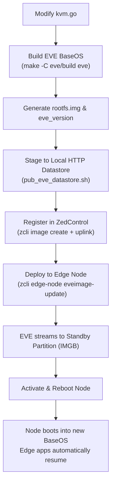

# Native ivshmem Support in EVE BaseOS

## 1. Executive Summary & Objective

The Ambarella virtualization architecture relies on two complementary transport mechanisms between the guest domain (Ubuntu HVM at EL1) and the host container (NOHYPER at EL2):

1. **`virtio-vsock` (Control Plane)**: Low-latency, connection-oriented point-to-point RPC and control messaging (CID 2, port 5555).
2. **`ivshmem` (Data Plane)**: Zero-copy shared DRAM window (`ivshmem-plain`, PCI vendor `0x1af4`, device `0x1110`, BAR 2) mapped to a shared backing file in host memory (`/dev/shm/amba-virt`). Size comes from model `cbattr.shmsize`. **Production is 1 GiB** (shared by Cavalry, DMA, SD/eMMC, and later frontends). **16 MiB was the PoC / verification run** on n1-655-devkit. Do not add a second ivshmem device per driver. See [Architecture.md](Architecture.md), [EVE-EdgeApp-Provision.md](EVE-EdgeApp-Provision.md).

While `virtio-vsock` is already enabled by stock EVE BaseOS, `ivshmem-plain` is currently absent from EVE's hypervisor device model. This document details the technical background, explains why runtime workarounds are unsuitable for production, and outlines the complete proposed implementation for integrating native `ivshmem` support directly into EVE BaseOS.

---

## 2. Background & Problem Analysis

### 2.1 Current Stock EVE Behavior

In stock EVE BaseOS (running KVM hypervisor on `arm64`):
- `domainmgr` automatically injects a `vhost-vsock-pci` device (`eve-vsock0`, guest CID 4) into every HVM domain configuration.
- Inside the guest, `lspci -nn` verifies the virtio socket device at `00:06.0 [1af4:1053]`.
- However, no `ivshmem` device is defined in EVE's QEMU templates. Consequently, the guest PCI bus has no device matching `1af4:1110`.
- Because the guest kernel module (`amba_virt.ko`) is implemented as a standard Linux PCI driver for `1af4:1110`, its `probe()` function never executes. Thus, the character device `/dev/amba_virt` is not instantiated, blocking userspace access.

### 2.2 Why Runtime Workarounds Fail

Attempts to inject `ivshmem` into an already-running EVE node without modifying BaseOS encounter fundamental hypervisor and controller barriers:

1. **`domainmgr` Dynamic Config Overwriting**:
   EVE's `domainmgr` daemon generates the QEMU configuration file (`/run/domainmgr/xen/xen<AppNum>.cfg`) dynamically on every domain lifecycle event (activation, restart, boot retry). Any manual additions appended to `xen<AppNum>.cfg` are truncated and overwritten with stock templates upon the next instance start.
2. **Containerd Supervision & 10-Minute Boot Backoff**:
   QEMU processes are supervised as containerd tasks. If QEMU is terminated out-of-band (e.g. `kill -9`), `domainmgr` detects an abnormal transition to `HALTED` / `BROKEN` and waits before restarting it:
   ```go
   domainBootRetryTime: 600 // 10 minutes in seconds
   ```
   This is a default rather than a hardcoded constant — it is overridable through `GlobalConfig` — but at its default value it means a failed experiment costs ten minutes or a power-cycle.
3. **ARM PCIe Architecture Limitations (No Root Complex Hotplug)**:
   Attempting to hot-add `ivshmem-plain` via QEMU Monitor Protocol (QMP) over unix socket fails immediately:
   ```json
   {"error": {"class": "GenericError", "desc": "Bus 'pcie.0' does not support hotplugging"}}
   ```
   On ARM `mach-virt`, the root PCIe bus (`pcie.0`) is non-hotpluggable. PCI devices must either be instantiated at initial QEMU launch or attached beneath pre-allocated `pcie-root-port` bridges.
4. **Controller & zcli Abstraction Boundary**:
   In ZEDEDA Cloud and `zcli`, the `--adapter` option only assigns entries defined in the edge node's `ioMemberList`. The guest-side `ivshmem` PCI device is emulated and has no such representation, so it cannot be assigned directly.

   That boundary is real but narrower than it first appears, and it is the hinge of the design. The host-side character device `/dev/amba_virt` *is* expressible as an `IO_TYPE_OTHER` member, which is how the NOHYPER container gets it. And an `IO_TYPE_OTHER` member that carries no physical resource at all is inert everywhere on the KVM path, so it can be attached to the HVM purely as a marker: EVE sees an adapter to reserve, and the patched `kvm.go` sees a request for a window. Its `cbattr` carries the parameters. So while `ivshmem` itself is not assignable, the decision to give a given app instance a window is fully controller-driven.

Therefore, the only clean, robust, and permanent solution is adding native `ivshmem` support to EVE's hypervisor template generator.

---

## 3. Proposed Implementation in EVE BaseOS

### 3.1 Target Component: EVE Pillar KVM Hypervisor

The QEMU domain configuration is managed in:
```text
eve/eve/pkg/pillar/hypervisor/kvm.go
```

### 3.2 Configuration Template Additions

Define the QEMU `ivshmem` template and data structure alongside the existing `qemuVsockTemplate`:

```go
const qemuIvshmemTemplate = `
[object "amba_shm"]
  qom-type = "memory-backend-file"
  mem-path = "{{.MemPath}}"
  size = "{{.Size}}"
  share = "on"

[device "amba-ivshmem"]
  driver = "ivshmem-plain"
  memdev = "amba_shm"
  master = "on"
`

type tQemuIvshmemContext struct {
    MemPath string
    Size    string
}
```

Register and parse the template in `init()`:

```go
var tQemuIvshmem *template.Template

func init() {
    // ... existing template registrations ...
    var err error
    tQemuIvshmem, err = template.New("qemuIvshmem").Parse(qemuIvshmemTemplate)
    if err != nil {
        panic(fmt.Errorf("parsing qemuIvshmemTemplate failed: %w", err))
    }
}
```

### 3.3 Backing Memory File Lifecycle

QEMU's `memory-backend-file` opens the path with `O_CREAT` and sizes it itself, so it would not actually abort on a missing file. `ensureSharedMemoryFile` exists for three other reasons: to pin the size and mode explicitly, to reject a size that cannot become a PCI BAR, and to turn a bad configuration into a clear error *before* QEMU launches rather than a `BROKEN` domain afterwards, which would then sit in the boot-retry backoff.

The size check matters because the window is mapped as BAR2 and QEMU enforces `PCI region size must be a power of two`. 256M and 512M are fine; 384M is not.

The file is deliberately never shrunk and never unlinked on teardown. A NOHYPER container may already hold a mapping of it, and leaving it in place means an HVM restart reuses the same region instead of invalidating the other end.

```go
func ensureSharedMemoryFile(w ivshmemWindow) error {
    if w.size < ivshmemMinSize {
        return logError("ivshmem window %s: size %d is below the %d byte minimum",
            w.id, w.size, ivshmemMinSize)
    }
    if w.size&(w.size-1) != 0 {
        return logError("ivshmem window %s: size %d is not a power of two",
            w.id, w.size)
    }
    f, err := os.OpenFile(w.memPath, os.O_RDWR|os.O_CREATE, 0600)
    if err != nil {
        return logError("ivshmem window %s: cannot open %s: %v", w.id, w.memPath, err)
    }
    defer f.Close()
    st, err := f.Stat()
    if err != nil {
        return logError("ivshmem window %s: cannot stat %s: %v", w.id, w.memPath, err)
    }
    if uint64(st.Size()) < w.size {
        if err := f.Truncate(int64(w.size)); err != nil {
            return logError("ivshmem window %s: cannot size %s to %d: %v",
                w.id, w.memPath, w.size, err)
        }
    }
    return nil
}
```

Note the error is returned rather than logged and swallowed. Continuing past a failure here would emit a config referring to a file that is missing or the wrong size, and the domain would fail at launch instead of at configuration time.

### 3.4 Template Execution in `CreateDomConfig()`

The stanza is appended to the domain configuration file (`xen<AppNum>.cfg`), but the path and size are **not** constants. They come from the adapters the controller assigned to this app instance, so an app with no `amba_shm` adapter gets no window and an unchanged config:

```go
    // Uses the same collector as the VMM overhead estimator so the cgroup
    // limit and the emitted devices cannot disagree. Goes before the vsock
    // block below so that vsock stays last.
    ivshmemWindows, err := collectIvshmemWindows(domainName, aa,
        config.IoAdapterList, config.UUIDandVersion.UUID)
    if err != nil {
        return err
    }
    for _, w := range ivshmemWindows {
        if err := ensureSharedMemoryFile(w); err != nil {
            return err
        }
        ivshmemContext := tQemuIvshmemContext{
            ID:      w.id,
            MemPath: w.memPath,
            Size:    w.size,
        }
        if err := tQemuIvshmem.Execute(file, ivshmemContext); err != nil {
            return logError("can't write ivshmem assignment to config file %s (%v)",
                file.Name(), err)
        }
    }
```

A bundle is recognised as a window request by `ivshmemWindowFromBundle`: an `IO_TYPE_OTHER` member with no `PciLong`, `Ifname`, `Serial` or `UsbAddr`. Parameters come from `cbattr` (`shmpath`, `shmsize`), falling back to `/dev/shm/<logicallabel>` at 16M if the controller ever drops unknown `cbattr` keys. Ordering matters: the stanza must precede the vsock block, which `CreateDomConfig` keeps last on purpose so QEMU assigns its PCI ID without conflicts.

### 3.4.1 Memory Accounting

Adding the device is not sufficient on its own. The window is real tmpfs memory, charged in full to whichever cgroup first faults the pages in — normally the QEMU container. EVE sizes that container's memory cgroup from `vmmOverhead`, which knows nothing about ivshmem, so a window larger than the default headroom (roughly 130 MiB) would get the domain OOM-killed. The same number flows through `CountMemOverhead` into `zedmanager`'s admission control, which would otherwise admit an app whose real footprint it had underestimated by the size of the window.

So `estimatedVMMOverhead` gains an `ivshmemVMMOverhead` term that adds the **whole** window, not a fraction of it. This differs deliberately from `mmioVMMOverhead`, which counts 1% of a passthrough aperture because it is modelling page-table cost rather than resident pages.

One caveat: `vmmOverhead` consults `VMMMaxMem` and the global `memory.vmm.limit.MiB` *before* falling back to the estimator. On a node where that global override is set, the ivshmem term is bypassed and the operator has to size the override to include the window.

### 3.5 Memory and Namespace Permissions

1. **QEMU Containment**:
   Verified on the node: the QEMU container, `pillar` and `xen-tools` all share the *host's* `/dev/shm`, because EVE bind-mounts it `rbind,rshared`. A file created there by `domainmgr` is the same inode QEMU opens. Mode `0600` is sufficient — QEMU runs as root — and is tighter than the `0666` originally proposed.

2. **NOHYPER Container Access**:
   NOHYPER containers **do not** share the host's `/dev/shm`. Containerd's default OCI spec gives each one a private `tmpfs`, so a NOHYPER app cannot reach the backing file by path. This invalidates any design in which both ends open `/dev/shm/amba-virt` directly.

   The container's only route to the window is the host-side character device `/dev/amba_virt`, created by `kmod/nohyper/amba_virt.ko`, which holds the backing file open and hands out mappings of it via `mmap`. That node is injected into the container by assigning the `amba_virt` `IO_TYPE_OTHER` adapter, which also supplies the cgroup device permission — so no manual `mknod` and no manual cgroup whitelisting.

3. **Load Ordering**:
   These two facts pull in opposite directions. `/dev/amba_virt` must exist *before* the NOHYPER container is created, because EVE resolves the device node at container-create time and a failed lookup only logs — the app would come up silently missing the device. But the backing file does not exist until the HVM domain starts, which is later and not ordered against it.

   So the module is loaded at boot from `/etc/init.d/000-mod-params` and no longer requires its backing file at load time. It registers the character device immediately and attaches the window on first use, re-reading the size each time. That also means a window grown by a model change is picked up on the next open rather than needing a module reload.

---

## 4. Build, Packaging & OTA Deployment Workflow

The update follows the validated dual-partition BaseOS procedure documented in `EVE-UpdateEVE-Firmware.md`.



### 4.1 Compiling EVE

Execute the build on the build server:
```bash
cd eve/build
make eve
```

The build system utilizes Docker for toolchains and outputs the final artifacts directly onto the host filesystem:
- **Rootfs Image**: `eve/eve/dist/arm64/current/installer/rootfs.img` (~262 MB)
- **Version String**: `eve/eve/dist/arm64/current/installer/eve_version`

### 4.2 Registering the Image in ZedControl

Using the helper script:
```bash
./scripts/pub_eve_datastore.sh ~/public_html/eve-images/
```

This automates:
1. Copying `rootfs.img` to `~/public_html/eve-images/<EVE_VER>/rootfs.img`.
2. Calculating the exact SHA-256 checksum and byte count.
3. Invoking `zcli image create` and `zcli image uplink` with `--type=Eve` and `--datastore-name=LocalHTTP`.

### 4.3 Triggering the OTA Update on the Edge Node

```bash
EVE_VER=$(cat eve/eve/dist/arm64/current/installer/eve_version)

# 1. Stage the candidate image to the node:
./scripts/zcli -- edge-node eveimage-update n1-655-devkit --image="${EVE_VER}"

# 2. Activate partition switch and reboot:
./scripts/zcli -- edge-node eveimage-update n1-655-devkit --image="${EVE_VER}" --activate
```

---

## 5. Reliability, Rollback & Data Preservation

### 5.1 Dual-Partition Safety (A/B Scheme)

| Partition | Role | Behavior During Update |
|---|---|---|
| **IMGA** | Active Rootfs | Serves current running system; never modified in-place |
| **IMGB** | Standby Rootfs | Receives the new `rootfs.img` payload |
| **PERSIST** (`/persist`) | Edge App Storage | **Completely untouched.** All persistent disks (`.qcow2`), container layers, snapshots, and instance configurations are preserved across reboots. |

### 5.2 10-Minute Probationary Test Window

1. Upon reboot, the node starts the new kernel and microservices under probationary status.
2. If the node fails to connect to ZedControl or critical services crash within 10 minutes, the watchdog / GRUB automatically rolls back to the previously active, known-good partition.
3. Once ZedControl verifies node health, the controller marks the new version as committed.

---

## 6. Post-Update Verification Matrix

After the node reports `Online` following the update:

| Step | Verification Command | Expected Result |
|---|---|---|
| **1. Node Firmware** | `./scripts/zcli -- edge-node show n1-655-devkit` | Active Image matches `$EVE_VER` |
| **2. Host Module** | EVE host: `lsmod \| grep amba_virt && ls -l /dev/amba_virt` | Loaded at boot; node present *before* any app starts |
| **3. Backing File** | EVE host: `ls -la /dev/shm/amba-virt` | Created once the HVM starts, size matches the model `shmsize` |
| **4. QEMU Config** | EVE host: `cat /run/domainmgr/xen/xen1.cfg` | Contains `[object "amba_shm"]` and `[device "amba_shm-dev"]`, both before `[device "eve-vsock0"]` |
| **5. Cgroup Limit** | EVE host: QEMU container `memory.limit_in_bytes` | Exceeds guest RAM by at least the window size |
| **6. Host Attach** | EVE host: `dmesg \| grep amba_virt` | `attached /dev/shm/amba-virt size N` after first open |
| **7. Guest PCI Bus** | Ubuntu HVM: `lspci -nn \| grep -E "1af4:1110\|1af4:1053"` | Both `1af4:1053` (vsock) AND `1af4:1110` (ivshmem) are listed |
| **8. Guest Driver** | Ubuntu HVM: `insmod amba_virt.ko && ls -l /dev/amba_virt` | Driver probes successfully; `/dev/amba_virt` created |
| **9. Container Device** | NOHYPER container: `ls -l /dev/amba_virt` | Present without any manual `mknod` and without a cgroup whitelist edit |
| **10. Vsock Ping** | Ubuntu HVM: `./bin/amba-virt-cli ping` | Server returns `PONG` |
| **11. Shared DRAM** | Ubuntu HVM: `./bin/amba-virt-cli shm` | Zero-copy data integrity verified with `SHM_ACK` |

Step 9 is the one that distinguishes a working integration from the earlier manual setup: if `/dev/amba_virt` only appears after a hand-run `mknod`, the model entry is not doing its job and the device will vanish on the next container recreate.

### 6.1 Measured results on n1-655-devkit

Steps 1–7 were confirmed on the devkit against EVE
`0.0.0-amba-ivshmem-fa7d9904` with `ubuntu_24_04_ivshmem.n1-655-devkit`
(`amba_shm` assigned, `shmsize` 16 MiB), using the pre-existing
`ubuntu_24_04.n1-655-devkit` as an unmodified baseline.

The chrdev major is allocated dynamically and came up as **507**, not the 506 an
earlier run saw. Nothing may hardcode it.

`domainmgr` rendered the window ahead of vsock, as intended:

```
[object "amba_shm"]
  qom-type = "memory-backend-file"
  mem-path = "/dev/shm/amba-virt"
  size = "16777216"
  share = "on"

[device "amba_shm-dev"]
  driver = "ivshmem-plain"
  memdev = "amba_shm"

[device "eve-vsock0"]
```

The guest sees the window as a RAM controller at `1af4:1110`, with BAR 0 (256 B)
for registers and BAR 2 carrying the 16 MiB region, alongside `eve-vsock0`. Read
back over QMP `query-pci`, which avoids needing guest credentials:

```
"device": 4368, "vendor": 6900   # 0x1110, 0x1af4
"bar": 0, "size": 256
"bar": 2, "size": 16777216
```

Memory accounting tracked the window exactly. Both the admission figure and the
QEMU container's cgroup ceiling rose by precisely 16,777,216 bytes against the
baseline HVM, which is what keeps `zedmanager` from over-admitting and the
kernel from OOM-killing QEMU:

| Quantity | Baseline HVM | ivshmem HVM | Delta |
|---|---|---|---|
| `AppInstanceStatus.MemOverhead` | 421,108,121 | 437,885,337 | +16,777,216 |
| QEMU container `memory.limit_in_bytes` | 1,494,847,488 | 1,511,624,704 | +16,777,216 |

Lazy attach resolved the load-order problem in practice. The module came up at
boot with the backing file still absent, and picked it up on first open once
`domainmgr` had created it:

```
[    7.624306] amba_virt host: shm /dev/shm/amba-virt (pending), vsock port 5555
[ 2650.651002] amba_virt: attached /dev/shm/amba-virt size 16777216
```

The original init-time `filp_open` would have failed the `modprobe` outright.

Two findings from the same run reinforce why the container must go through
`/dev/amba_virt` and why the device has to come from the model. The NOHYPER
container's `/dev/shm` is a private, empty 64 MiB tmpfs — it cannot see the
host's backing file at all:

```
/dev/shm rw,nosuid,nodev,noexec,relatime - tmpfs shm rw,size=65536k
```

And its `/dev` held `cavalry`, `cavalry_profile` and `gpiochip0` but no
`amba_virt`, the difference being that the first three are model bundles
assigned to that instance and `amba_virt` was not. EVE injects the node and its
cgroup device rule strictly from the assigned adapters.

Steps 8–11 were then completed against a new NOHYPER instance,
`ubuntu_24_04_container_amba.n1-655-devkit`, on edge-app
`ubuntu_24_04-container-amba`. A new app was needed for the same reason as on
the HVM side, and the old devkit container instance had to be deleted first
because an `assigngrp` cannot be held by two instances at once. See
[EVE-ReconfigureEdgeApps.md](EVE-ReconfigureEdgeApps.md).

**Step 9 is the one that matters, and it passes.** EVE injected the node *and*
the matching cgroup rule purely from the assigned adapter, with no `mknod` and
no hand-edited `devices.allow`:

```
crw-rw-rw-  1 root root  507, 0  /dev/amba_virt     # in the container
c 507:0 rwm                                         # its devices.list
```

The major is the dynamically allocated 507, which nothing in the model,
the app or the container hardcodes.

Inside the HVM both transports are present, and the guest driver binds the
window at the same address and size QMP reported from the host:

```
00:06.0 RAM memory [0500]: Red Hat, Inc. Inter-VM shared memory [1af4:1110]
00:07.0 Communication controller [0780]: Red Hat, Inc. Virtio 1.0 socket [1af4:1053]

amba_virt 0000:00:06.0: amba_virt guest: shm phys 0x8000000000 size 16777216
```

The guest module must be built against the HVM's own headers — that guest is
`6.8.0-137-generic`, and `modversions` means a near-miss vermagic will not load.
Build it in the VM with `make build-hvm`, per [poc/README.md](../poc/README.md).

Both planes then completed end to end, with `amba-virt-server` running in the
NOHYPER container against its injected `/dev/amba_virt`:

```
$ sudo ./bin/amba-virt-cli ping
proto=1 role=0 shm=16777216 connected=1 cid=2 port=5555
PONG seq=1

$ sudo ./bin/amba-virt-cli shm
SHM_ACK seq=7 off=0 len=256 first=7
```

The data plane is genuinely zero-copy rather than a relayed round trip: the
bytes the guest wrote into its ivshmem BAR are directly readable in the host's
backing file, with `first=7` matching `seq=7`.

```
# od -An -tx1 -N16 /dev/shm/amba-virt
 07 08 09 0a 0b 0c 0d 0e 0f 10 11 12 13 14 15 16
```

All eleven steps pass. Shared DRAM between an HVM and a NOHYPER container on
stock-configured EVE, with the window and its memory accounting driven entirely
from the controller model.

---

## 7. Next Steps & Recommendations

1. **Review**: Review the proposed template additions and backing file allocation in Section 3.
2. **Code Edit**: Apply the changes to `eve/eve/pkg/pillar/hypervisor/kvm.go`.
3. **Build Execution**: Trigger `make -C eve/build eve` on the builder.
4. **Deployment**: Publish to LocalHTTP and run `eveimage-update` on `n1-655-devkit`.
