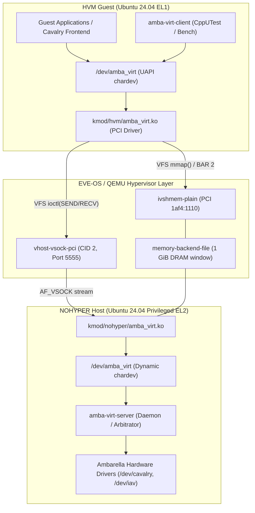
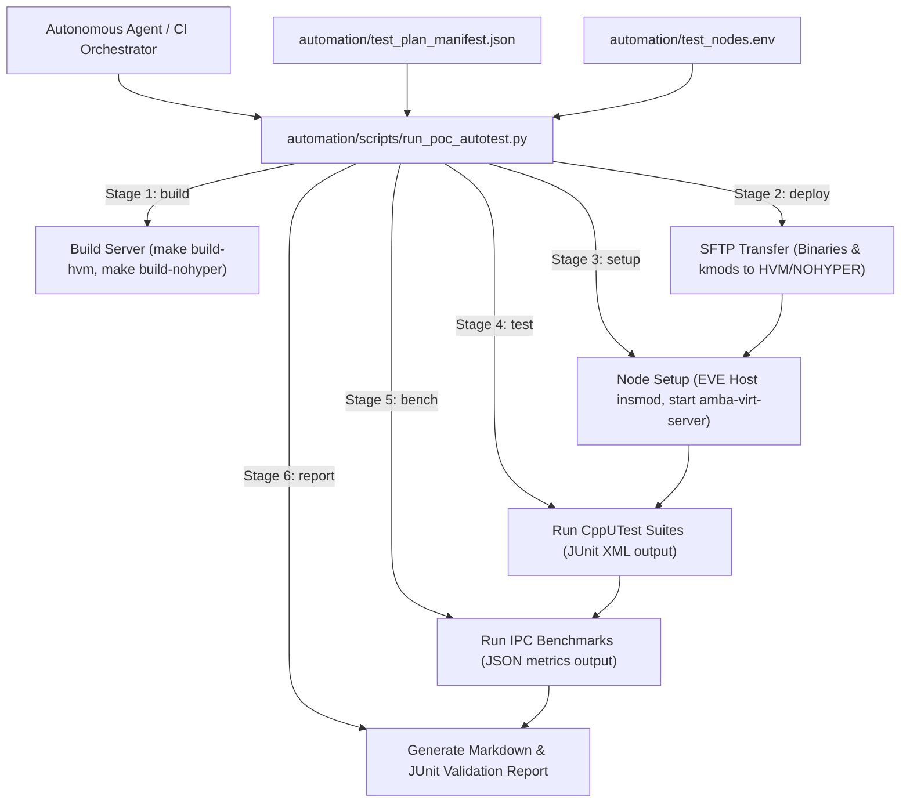

# PoC Virtual Drivers: Transport Architecture, Test Specification & Benchmarking

This document specifies the architecture, functional test matrix, and IPC performance benchmarking methodology for the Ambarella device virtualization transport (`amba-virt`). The transport bridges an Ubuntu **HVM** (EL1 guest) and a privileged **NOHYPER** container (EL2 host) within EVE-OS, using **virtio-vsock** for low-latency control messaging and **ivshmem** for high-throughput zero-copy data transfer.

System context: [Architecture.md](Architecture.md). Cavalry on top of this transport: [CavalryVirtualization.md](CavalryVirtualization.md). Provisioning: [EVE-EdgeApp-Provision.md](EVE-EdgeApp-Provision.md). Driver code: [drivers/amba_virt/](../drivers/amba_virt/README.md) and [guest-os/](../guest-os/).

---

## 1. Foundational Architecture

The architecture provides a unified character device interface (`/dev/amba_virt`) across both execution domains. Guest applications interact with hardware accelerators (such as the Ambarella Cavalry Neural Network processor and DSPs) without requiring physical hardware passthrough to the guest.



### 1.1 One BAR, Many Frontends
The HVM guest is provisioned with a single `ivshmem-plain` device (`1af4:1110`). Rather than provisioning separate shared memory windows for each virtualized peripheral, all frontends (Cavalry NN, video streaming buffers, DMA channels) share a single 1 GiB DRAM aperture (`cbattr.shmsize` on `amba_shm`). Offsets and buffer lengths within the window are coordinated over vsock framing messages.

### 1.2 Channel Separation & Transport Roles
- **Control Plane (`virtio-vsock`)**: Delivers framed, synchronous and asynchronous control RPCs (initialization, memory region allocation, job dispatch, completion interrupts). The guest communicates with host CID 2 on dedicated port 5555. (Port 2000 is strictly reserved for EVE VComLink management and is never used).
- **Data Plane (`ivshmem`)**: Provides zero-copy shared DRAM mapping between guest user space and host physical memory. Payloads (image frames, neural network weight tensors, feature maps) are placed in shared buffers; only 64-bit offsets and size descriptors traverse the vsock control channel.

### 1.3 Compilation Matrix

| Side | Binary | Role | Headers / Toolchain |
|---|---|---|---|
| HVM | `amba_virt.ko` | PCI ivshmem BAR2 driver + kernel vsock client | Ubuntu 24.04 `linux-headers-$(uname -r)` |
| HVM | `amba-virt-client` | CppUTest functional test suite & IPC benchmarking tool | `g++` (`-std=c++17`, `-lCppUTest`, `-lCppUTestExt`, `-lpthread`) |
| NOHYPER | `amba_virt.ko` | Shm backing file mmap + kernel vsock server | Ambarella `eve-kernel` / EVE host kernel |
| NOHYPER | `amba-virt-server` | Echo daemon, integrity validator, hardware arbitrator | `gcc` (`-std=c11`, `-lpthread`) |

---

## 2. Ambarella Device Virtualization Model

The transport is designed as the underlying substrate for multi-tenant and sandboxed Ambarella edge intelligence applications:

### 2.1 Cavalry Neural Network Accelerator
The Ambarella Cavalry engine processes deep neural network inference pipelines. Under the virtualized model:
1. The guest application compiles neural networks into Cavalry binary formats (`cavalry.bin`).
2. Tensors, session descriptors, and inference input frames are loaded directly into an `ivshmem` buffer slice.
3. The guest Cavalry user space shim issues `ioctl(fd, AMBA_VIRT_IOC_SEND)` with a `cavalry_cmd_pkg` packet containing input/output shared memory offsets.
4. The NOHYPER arbitrator receives the command, validates memory bounds against the allocated session window, translates virtual offsets to host physical addresses, and forwards the command to the physical `/dev/cavalry` driver.
5. Upon hardware interrupt completion, the arbitrator writes the completion status and returns an acknowledgment over vsock.

### 2.2 DSP & Video Input/Output Virtualization
High-framerate video frames from image sensor pipelines (`/dev/iav`) are captured directly into pre-registered circular ring buffers in `ivshmem`. Virtual camera drivers in the guest receive timestamped frame descriptors over vsock, achieving zero-copy video ingestion into guest AI workloads at 4K60.

---

## 3. Comprehensive Test Specification (CppUTest)

The functional validation suite is structured using the **CppUTest** unit testing framework within `guest-os/client/amba-virt-client.cxx`. It verifies kernel driver robustness, POSIX VFS compliance, protocol corner cases, memory integrity, and multi-thread concurrency.

### 3.1 VFS System Call Compliance (`TEST_GROUP(VFS)`)

The `/dev/amba_virt` character device node must rigorously adhere to Linux VFS semantics:

| System Call | Test Scenarios | Expected Driver Behavior |
|---|---|---|
| `open()` | Valid read/write open, missing device node handling, flag permutations (`O_RDWR`, `O_RDONLY`, `O_NONBLOCK`, `O_CLOEXEC`), permission enforcement (`0666`) | Succeeds for valid flags; assigns private file context; lazily binds PCI resource |
| `close()` | Standard close, close with active mapped buffers, close with in-flight vsock requests, double close prevention | Decrements reference count; cleanly releases descriptor state and private data structures |
| `read()` / `write()` | Invoking standard POSIX `read(fd, ...)` and `write(fd, ...)` | Driver relies on `ioctl` for framing; character device returns `-EINVAL` or standard fallback error without kernel crash |
| `lseek()` | `lseek(fd, 0, SEEK_SET)`, `SEEK_CUR`, `SEEK_END` | Character device returns `-ESPIPE` (illegal seek) |
| `ioctl()` | `AMBA_VIRT_IOC_GET_INFO`, `AMBA_VIRT_IOC_CONNECT`, `AMBA_VIRT_IOC_SEND`, `AMBA_VIRT_IOC_RECV` | Valid inputs return 0; invalid pointer arguments return `-EFAULT`; unmapped/invalid command magics return `-ENOTTY` |
| `mmap()` | Map full `shm_size`, map 4KB/64KB sub-pages, unaligned offsets, boundary mapping at `shm_size - PAGE_SIZE`, over-allocation | Maps PCI BAR 2 pages into user space with `PROT_READ \| PROT_WRITE`; requests exceeding `shm_size` return `-EINVAL` |
| `munmap()` / `msync()` | Unmap active pages, invoke `msync(MS_SYNC)` / `msync(MS_ASYNC)` across mapped bounds | Unmaps pages without faulting; memory synchronizes cleanly |
| `fcntl()` | Toggle `O_NONBLOCK`, verify `F_GETFL`/`F_SETFL`, file descriptor duplication via `F_DUPFD`, `dup()`, `dup2()` | Properly duplicates descriptor; shares underlying kernel file object |
| `poll()` / `select()` | Edge-triggered and level-triggered polling on `/dev/amba_virt` | Returns readability/writability mask based on vsock queue occupancy |

### 3.2 virt-vsock Protocol Edge Cases (`TEST_GROUP(Vsock)`)

The control channel exercises protocol boundaries and fault tolerance:
- **Zero-Byte Payloads**: Sending `AMBA_VIRT_IOC_SEND` with `len = 0` must be cleanly rejected with `-EINVAL`.
- **Maximum Payload Boundaries**: Sending payloads at 1B, 64B, 512B, 1024B, 4096B (`AMBA_VIRT_MAX_MSG`), and 4097B (must return `-EINVAL`).
- **Timeout Semantics**:
  - `timeout_ms = 0`: Defaults to standard 5000ms timeout.
  - `timeout_ms = 50`: Rapid timeout when awaiting non-existent response; returns `-ETIMEDOUT`.
  - `timeout_ms < 0`: Blocking wait mode until peer sends acknowledgment.
- **Connection Churn & Stress**: Rapid open/connect/close bursts (1,000 cycles) to verify vsock socket state cleanup and absence of socket descriptor leakage in both guest and host kernels.

### 3.3 ivshmem Shared Memory Integrity (`TEST_GROUP(SHM)`)

Validates shared DRAM coherency across hypervisor boundaries:
- **Pattern Verification**: End-to-end writes across multi-megabyte buffers using pseudo-random bit sequences (PRBS31), incremental 64-bit integer counters, and walking-one bit patterns.
- **Cacheline & Page Alignments**: Reads and writes across 64-byte cacheline boundaries, 4KB page boundaries, and intentionally unaligned offsets (odd byte offsets).
- **Notification Handshake**:
  1. Client writes structured payload into shared memory slice at `shm_offset`.
  2. Client issues `AMBA_VIRT_IOC_SEND` containing `shm_offset`, `len`, and `FLAG_SHM_NOTIFY`.
  3. Server verifies data integrity, performs an in-place transformation (e.g., bitwise inversion or CRC calculation), and replies with `FLAG_SHM_ACK`.
  4. Client verifies the modified pattern matches expected transformed state.

### 3.4 Multi-FD Concurrency & Scaling (`TEST_GROUP(MultiFD)`)

Validates thread safety and driver mutex contention under concurrent workloads:
- Multiple file descriptors opened concurrently by independent threads within a single process.
- Scaled concurrency across $T \in \{1, 2, 4, 8, 16\}$ threads.
- Driver lock evaluation: Measures serialization overhead and calculates the multi-thread scaling factor:
  $$\text{Scaling Factor}(T) = \frac{\text{Aggregate Throughput}(T)}{\text{Throughput}(1)}$$

---

## 4. IPC Performance Benchmarking Methodology

The benchmarking suite measures transport performance under production-grade conditions to ensure the virtualization layer introduces negligible latency overhead over bare-metal execution.

### 4.1 Vsock Control Plane Round-Trip Latency (RTT)
Measures the complete round-trip time of a framed vsock message (Client Send $\rightarrow$ Driver $\rightarrow$ Vsock $\rightarrow$ Host Server Echo $\rightarrow$ Driver $\rightarrow$ Client Receive).
- **Payload Sweep**: 16B, 64B, 256B, 1KB, 2KB, 4KB.
- **Sample Size**: 10,000 iterations per payload size.
- **Reported Metrics**: Min, Median (p50), Mean, p90, p95, p99, Max, and ops/sec.

### 4.2 Vsock Streaming Throughput
Measures sustained control message bandwidth by streaming unacknowledged vsock packets across the interface.
- **Metrics**: Data transfer rate in MB/s and packet rate in kpps.

### 4.3 ivshmem Zero-Copy Throughput & Handoff Latency
Measures the data plane handoff performance where large buffers are populated in shared memory and signaled via vsock:
- **Buffer Sweep**: 4KB, 64KB, 256KB, 1MB, 4MB, 16MB, 64MB.
- **Measured Parameters**:
  - Memory write bandwidth (GB/s).
  - Vsock notification latency ($\mu$s).
  - Effective handoff bandwidth:
    $$\text{Effective Bandwidth} = \frac{\text{Buffer Size}}{\text{Write Time} + \text{Signaling Time} + \text{Peer Read Time}}$$

### 4.4 Simulated Workload: Cavalry Tensor Dispatch
Simulates high-framerate neural network dispatch:
- Client deposits 4MB image tensor + 64KB inference parameter block into ivshmem.
- Client signals inference start over vsock.
- Server performs mock inference delay (or real dispatch if hardware present) and signals completion.
- Evaluates sustained FPS (Frames Per Second) and latency jitter.

---

## 5. Automated Orchestration & AI Agent Runbook

All automated test orchestration scripts, test manifests, and agent runbooks reside in `automation/` (isolated from public repository releases).

### 5.1 Orchestration Architecture

The test orchestrator (`automation/scripts/run_poc_autotest.py`) executes end-to-end continuous validation across target edge nodes:



### 5.2 Orchestrator Execution Commands

Agents execute the pipeline using specific stage selectors:

```bash
# Full end-to-end validation pipeline
python3 automation/scripts/run_poc_autotest.py --node n1-655-devkit --stage all

# Step-by-step modular execution
python3 automation/scripts/run_poc_autotest.py --node n1-655-devkit --stage build
python3 automation/scripts/run_poc_autotest.py --node n1-655-devkit --stage deploy
python3 automation/scripts/run_poc_autotest.py --node n1-655-devkit --stage setup
python3 automation/scripts/run_poc_autotest.py --node n1-655-devkit --stage test
python3 automation/scripts/run_poc_autotest.py --node n1-655-devkit --stage bench
python3 automation/scripts/run_poc_autotest.py --node n1-655-devkit --stage report
```

### 5.3 Diagnostic & Error Recovery Triage

Autonomous agents encountering test failures follow this deterministic triage matrix:

| Failure Mode / Symptom | Root Cause | Agent Remediation Protocol |
|---|---|---|
| `ssh: connect to host ... port 22: Connection refused` | EVE debug SSH daemon inactive | Issue `./scripts/zcli -- edge-node update <node> --config="debug.enable.ssh:<key>"` to trigger cloud controller configuration push. |
| `ssh: Permission denied (publickey)` | Incorrect SSH key passed | Verify target IP: Use `~/.ssh/id_ed25519.ambarella` for devkit (`.34`) and `~/.ssh/id_rsa.ambarella` for pro (`.33`). |
| `open(/dev/amba_virt): No such file or directory` (HVM) | Guest `amba_virt.ko` not inserted | Run `lspci -nn \| grep 1af4:1110`. If PCI device is present, run `sudo insmod ~/amba_virt.ko`. Check `dmesg \| tail -n 20`. |
| `open(/dev/amba_virt): No such file or directory` (NOHYPER) | Container missing cgroup rule or adapter not bound | Verify `zcli edge-app-instance show <instance>`. Ensure `amba_virt` `IO_TYPE_OTHER` adapter is assigned in the hardware model. |
| `ioctl(CONNECT): Connection refused` | `amba-virt-server` not active | Check server daemon on NOHYPER (`pgrep amba-virt-server`). Inspect `/tmp/amba-virt-server.log`. Restart server on port 5555. |
| `mmap: Invalid argument (EINVAL)` | Buffer size exceeds 1 GiB window | Query driver via `AMBA_VIRT_IOC_GET_INFO`. Ensure buffer offsets and mapping sizes are page-aligned and $\le$ `shm_size`. |
| Latency regression (p99 > 2000 $\mu$s) | CPU throttling or core frequency scaling | Inspect CPU governor on host (`cpupower frequency-info`). Verify background container CPU utilization. |
