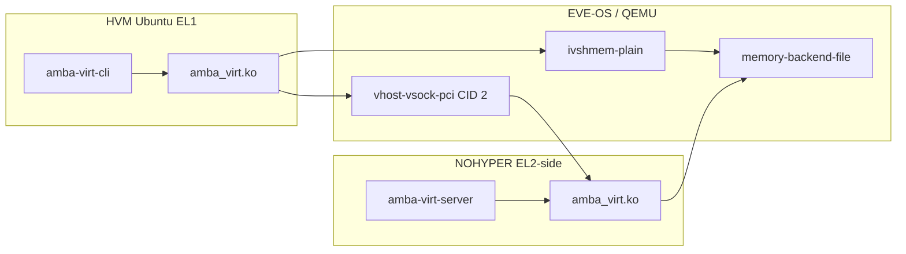

# Virtual drivers (vsock + ivshmem)

Chosen path between an Ubuntu **HVM** (EL1) and a **NOHYPER** privileged
container (EL2 host): **virtio-vsock** for control messages and **ivshmem**
for shared memory. Matching kernel modules on both sides expose
`/dev/amba_virt`. A userspace server in NOHYPER is the peer (and later the
hardware proxy / arbitrator).

System picture: [Architecture.md](Architecture.md). Cavalry on top of this
transport: [CavalryVirtualization.md](CavalryVirtualization.md). PoC sources:
[poc/](../poc/README.md).



---

## What each side compiles

| Side | Binary | Role | Build against |
|---|---|---|---|
| HVM | `amba_virt.ko` (hvm) | PCI ivshmem BAR mmap + kernel vsock client → CID 2:5555 | Ubuntu `linux-headers` (`KDIR_HVM`) |
| HVM | `amba-virt-cli` | Userspace smoke test via `/dev/amba_virt` | — |
| NOHYPER | `amba_virt.ko` (nohyper) | mmap ivshmem backing file + kernel vsock listen | `eve-kernel` / EVE (`KDIR_NOHYPER`) |
| NOHYPER | `amba-virt-server` | Echo / shm verify; later Cavalry arbitrator | — |

Same UAPI on both chardevs: `open`, `mmap`, `AMBA_VIRT_IOC_{GET_INFO,SEND,RECV}`.
Userspace does not open `AF_VSOCK` itself.

Do not mount `eve-kernel` into the HVM. Guest modules use Ubuntu headers;
Cavalry ioctl ABI for a later guest frontend is copied UAPI only, not the
Ambarella tree.

---

## EVE notes

- **vsock is stock.** Every HVM gets `vhost-vsock-pci` (`eve-vsock0`). Guest
  `modprobe virtio_vsock` if `/dev/vsock` is missing. Direction is always
  **guest → host CID 2**.
- **Do not use port 2000** (EVE VComLink). The transport uses **5555**.
- **ivshmem is not stock.** QEMU needs
  `-object memory-backend-file,...,share=on` and `-device ivshmem-plain`.
  Adding this natively to EVE's hypervisor template generator (`kvm.go`) and
  performing an A/B partition BaseOS OTA update is the production architecture.
  See full design in [Native-ivshmem-Support-in-EVE-BaseOS.md](Native-ivshmem-Support-in-EVE-BaseOS.md).
- **Guest device lifecycle:** The guest module `amba_virt.ko` is a PCI driver
  for device `1af4:1110`. The character device `/dev/amba_virt` is instantiated
  inside `amba_virt_pci_probe()`. If QEMU does not present `1af4:1110` to the
  guest, `insmod` will register the driver but `/dev/amba_virt` will not be
  created.
- **Host module signing:** The EVE host kernel verifies module signatures.
  Out-of-tree builds of `kmod/nohyper/amba_virt.ko` must be signed with the kernel
  build certificate (`certs/signing_key.pem`) to avoid vermagic or signature
  rejection on load.
- **Dynamic device nodes & container cgroups:** Both `amba-virt-cli` and
  `amba-virt-server` automatically inspect `/sys/class/amba_virt/amba_virt/dev`
  and `/proc/devices` to create `/dev/amba_virt` via `mknod()` if absent.
  Running `amba-virt-server` inside a NOHYPER container requires whitelisting the
  allocated major (e.g. 506) in the container's device cgroup:
  ```bash
  echo "c 506:* rwm" > /sys/fs/cgroup/devices/eve-user-apps/<container-id>/devices.allow
  ```

---

## Local QEMU (no EVE)

See [poc/README.md](../poc/README.md) for a concrete
command line: `vhost-vsock-pci` + `ivshmem-plain` + shared `memory-backend-file`.

