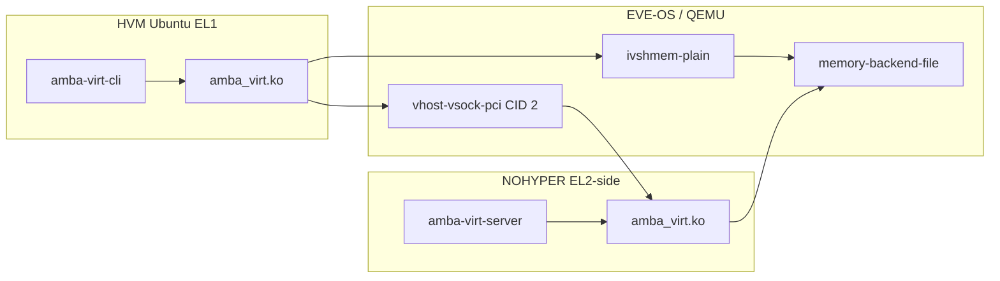

# Virtual drivers (vsock + ivshmem)

Chosen path between an Ubuntu **HVM** (EL1) and a **NOHYPER** privileged
container (EL2 host): **virtio-vsock** for control messages and **ivshmem**
for shared memory. Matching kernel modules on both sides expose
`/dev/amba_virt`. A userspace server in NOHYPER is the peer (and later the
hardware proxy / arbitrator).

System picture: [Architecture.md](Architecture.md). Cavalry on top of this
transport: [CavalryVirtualization.md](CavalryVirtualization.md). PoC sources:
[poc/](../poc/README.md).

---

## What each side compiles

| Side | Binary | Role | Build against |
|---|---|---|---|
| HVM | `amba_virt.ko` (guest) | PCI ivshmem BAR mmap + kernel vsock client → CID 2:5555 | Ubuntu `linux-headers` (`KDIR_GUEST`) |
| HVM | `amba-virt-cli` | Userspace smoke test via `/dev/amba_virt` | — |
| NOHYPER | `amba_virt.ko` (host) | mmap ivshmem backing file + kernel vsock listen | `eve-kernel` / EVE (`KDIR_HOST`) |
| NOHYPER | `amba-virt-server` | Echo / shm verify; later Cavalry arbitrator | — |

Same UAPI on both chardevs: `open`, `mmap`, `AMBA_VIRT_IOC_{GET_INFO,SEND,RECV}`.
Userspace does not open `AF_VSOCK` itself.

Do not mount `eve-kernel` into the HVM. Guest modules use Ubuntu headers;
Cavalry ioctl ABI for a later guest frontend is copied UAPI only, not the
Ambarella tree.

---

## EVE notes

- **vsock is stock.** Every HVM gets `vhost-vsock-pci` (`eve-vsock0`). Guest
  `modprobe virtio_vsock` if `/dev/vsock` is missing. Direction is always
  **guest → host CID 2**.
- **Do not use port 2000** (EVE VComLink). The transport uses **5555**.
- **ivshmem is not stock.** QEMU needs
  `-object memory-backend-file,...,share=on` and `-device ivshmem-plain`.
  The same file must be visible in the NOHYPER container. That is
  device-model / Zedcontroller work, not an in-tree EVE default.
- **Host `insmod` loads into the EVE kernel.** Build the host kmod against
  `eve-kernel` (`../eve/eve-kernel` from `amba-virt`) or, on the device,
  `/lib/modules/$(uname -r)/build`. A mismatched module can fail to load
  or panic the host. Guest kmods use `KDIR_GUEST` (Ubuntu). See
  [poc/README.md](../poc/README.md).
- `socket(AF_VSOCK)` from a container is typically allowed on EVE
  (`oci.WithDefaultSpec()`, not Docker’s vsock-blocking seccomp). Still
  verify on the node. The kmod uses in-kernel vsock, so the container needs
  permission to `insmod` and the host kernel needs `CONFIG_VSOCKETS`.

vhost-user (UNIX socket into a container) is a possible later backend. It is
not required for this transport.

---

## Local QEMU (no EVE)

See [poc/README.md](../poc/README.md) for a concrete
command line: `vhost-vsock-pci` + `ivshmem-plain` + shared `memory-backend-file`.
